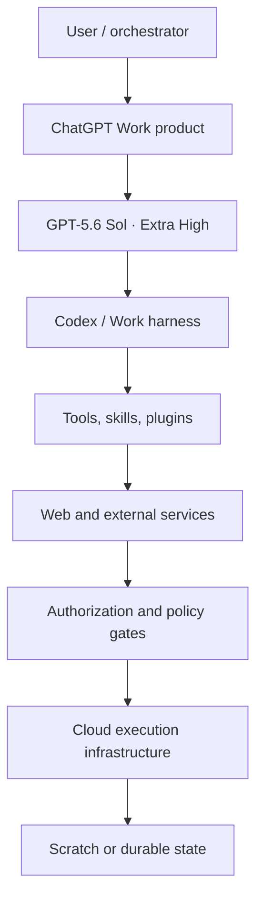

# CURRENT_MODEL_MAX_OPERATING_MANUAL.md

**Operating manual for GPT-5.6 Sol at Extra High reasoning in ChatGPT Work on the web, as configured for this conversation.**

Compiled: 2026-09-04 UTC  
Profile target: GPT-5.6 Sol · Extra High (`xhigh`) · ChatGPT Work/web  
Purpose: human-readable operating guide plus machine-readable material for another orchestrator, CoScientist, coding agent, research agent, or model router.

---

## PRE-FLIGHT CONFIGURATION — RESOLVED

```text
profiled model:              GPT-5.6 Sol                              [D][OC]
API model identifier:        gpt-5.6-sol                              [D]
provider:                    OpenAI                                   [D]
application:                 ChatGPT Work on the web                  [OC]
harness:                     Codex/ChatGPT Work agent harness         [D][OS]
requested by source brief:   maximum available effort                [OC]
surface configuration:       Extra High                              [OC]
API-equivalent label:        xhigh                                   [D][I]
highest model effort:        max                                     [D]
current effective profile:   xhigh, not max                           [OC]
API context window:          1,050,000 tokens                         [D]
API maximum output:          128,000 tokens                           [D]
knowledge cutoff:            2026-02-16                               [D]
actual serving build:        not exposed                             [U]
actual per-turn reasoning:   not exposed                             [U]
session type:                interactive cloud Work session           [OC]
```

### REQUESTED / OBSERVED / MAXIMUM SUPPORTED

| Dimension | Value | Evidence | Operational consequence |
| --- | --- | --- | --- |
| Requested | Maximum available | Source brief `[OC]` | The profiler must check rather than assume compliance. |
| Observed surface selection | GPT-5.6 Sol, Extra High | Current Work configuration `[OC]` | Treat the current effort as `xhigh`. |
| Maximum supported by GPT-5.6 | `max` | OpenAI model guidance `[D]` | This session must not be described as Max unless the product reports Max. |
| Ultra | Product-level multi-agent mode, not an effort synonym | OpenAI Codex model guide `[D]` | Ultra changes orchestration; it does not prove a deeper single-model reasoning setting. |
| Pro mode | API reasoning mode independent of effort | OpenAI model guidance `[D]` | Not exposed as an active setting in this Work conversation `[U]`. |

**Identity caution.** “GPT-5.6 Sol Extra High” is the configured profile. The serving build, exact request payload, reasoning-token consumption, cache state, and internal reasoning trace are unavailable. An orchestrator must use provider response metadata when exact serving identity is load-bearing.

### SCOPE BOUNDARY

This manual does not disclose private chain-of-thought, hidden tokens, confidential instructions, credentials, security internals, or model weights. It supplies operational summaries, decision rules, observable behavior, tool contracts, and benchmark designs. Descriptions of reasoning are workflow-level characterizations, not transcripts of private reasoning.

### OFFICIAL BASELINE SOURCES

- [GPT-5.6 Sol model page](https://developers.openai.com/api/docs/models/gpt-5.6-sol) — model ID, context, maximum output, cutoff, effort levels, API pricing.
- [GPT-5.6 model guidance](https://developers.openai.com/api/docs/guides/latest-model) — programmatic tool calling, persisted reasoning, caching, Max, Pro, frontend and intent improvements.
- [Models in ChatGPT and Codex](https://learn.chatgpt.com/docs/models) — Sol/Terra/Luna roles, Work effort labels, Max and Ultra.
- [Get started with ChatGPT Work](https://learn.chatgpt.com/docs/get-started-with-work) — files, tools, plugins, substantial tasks, reviewable outputs, local/cloud distinction.
- [Build skills](https://learn.chatgpt.com/docs/build-skills) — reusable skills and plugin distribution.
- [Model Context Protocol](https://learn.chatgpt.com/docs/extend/mcp?surface=cli) — MCP tools and context.

All links were retrieved on 2026-09-03/04. Product capabilities can change; re-run the boot sequence in §62 before relying on this snapshot.

---

## EVIDENCE AND ATTRIBUTION KEY

**Evidence:** `[D]` documented · `[OS]` observed in tool/schema · `[OC]` observed in configuration or session metadata · `[OP]` direct probe · `[OE]` successful end-to-end execution · `[OA]` authenticated external access · `[S]` self-described operational characterization · `[I]` inference · `[U]` unknown.

**Layers:** `M` base model · `P` product/application · `H` agent harness · `T` connected tool · `E` external service · `A` authorization/permissions · `I` infrastructure.

Two invariants:

1. A visible tool is not a tested tool: `[OS] ≠ [OE]`.
2. A connector is not authenticated merely because its schema is exposed: `[OS] ≠ [OA]`.

---

# PART I — NAVIGATION MAP

## 1. EXACT RUNTIME IDENTITY

| Field | Current value | Layer | Class |
| --- | --- | --- | --- |
| Provider | OpenAI | M | `[D]` |
| Family | GPT-5.6 | M | `[D]` |
| Profiled model | GPT-5.6 Sol | M | `[D][OC]` |
| API identifier | `gpt-5.6-sol`; alias `gpt-5.6` routes to Sol | M | `[D]` |
| Serving build | Not exposed | M/I | `[U]` |
| Reasoning effort | Extra High / `xhigh` | M/P | `[OC][I]` |
| Highest effort | `max` | M | `[D]` |
| Reasoning levels | API: none, low, medium, high, xhigh, max | M | `[D]` |
| Other reasoning mode | Pro exists in API and is independent of effort | M/P | `[D]`; active state `[U]` |
| Product | ChatGPT Work on the web | P | `[OC]` |
| Harness | Codex/Work agent harness with skills, tools, plugins, plans, and optional subagents | H | `[D][OS]` |
| Host | Cloud Linux execution environment | I | `[OP]` |
| Hardware snapshot | 9 logical CPUs; 15 GiB RAM; no swap; no visible GPU | I | `[OP]` |
| Scratch disk | 32 GiB filesystem; about 29 GiB free at probe time | I | `[OP]` |
| Knowledge cutoff | 2026-02-16 | M | `[D]` |
| API context window | 1,050,000 tokens | M | `[D]` |
| Effective Work context | Not exposed; conversation compaction may occur | P/H | `[U]` |
| API max output | 128,000 tokens | M | `[D]` |
| Effective Work output cap | Not exposed and may be lower | P/H | `[U]` |
| Input modalities | Text, images, and files through the product/tools | M/P/T | `[D][OS]` |
| Direct model output | Text/structured tool calls; binary artifacts are created by tools | M/H/T | `[OS]` |
| Generated images | Available through ImageGen tool, not intrinsic text output | T | `[OS]` |
| Durable file persistence | ChatGPT Library; authenticated Google Drive; GitHub repository state; Sites; automations | E | `[OS]`, selected stores `[OA]` |
| Scratch persistence | Conversation/session workspace; not a durable project authority | I | `[OC]` |

## 2. “WHAT AM I OPERATING?” MAP



| Layer | Contributes | Does not prove |
| --- | --- | --- |
| User/orchestrator | Goal, authority, constraints, acceptance criteria | Technical feasibility |
| Product | Model selection, UI, files, progress, conversation continuity | That every documented API feature is enabled |
| Model | Reasoning, language, code generation, vision interpretation, tool-selection judgment | File access, browsing, execution, authentication, persistence |
| Harness | Tool loop, progress, plan state, skill loading, optional delegation | Correct tool results |
| Tools/skills/plugins | Concrete operations and repeatable workflows | Authentication or permission |
| External service | Source data and external effects | That the result is accurate or current without verification |
| Authorization | Defines which actions may occur | That the action is safe or intended |
| Infrastructure | CPU, memory, runtimes, filesystem, network | Durable storage |
| State | Scratch supports working; Library/Git/Drive/Sites support persistence | That the newest copy is canonical unless declared |

The most important attribution rule is: **the model does not “have GitHub,” “have Drive,” or “create a PPTX” by itself.** The harness exposes tools; a connector and authorization reach the service; the model chooses and sequences calls.

## 3. EXECUTION ENVIRONMENT INVENTORY

States: `A` available · `AI` available after install if policy/network permits · `AX` available through an external service/tool · `B` absent or blocked · `U` unknown.

| Component | State | Current snapshot | Class |
| --- | --- | --- | --- |
| CPU | A | 9 logical CPUs | `[OP]` |
| RAM | A | 15 GiB total, about 14 GiB available at probe | `[OP]` |
| Swap | B | 0 | `[OP]` |
| GPU | B | `nvidia-smi` absent; no GPU exposed | `[OP]` |
| Disk | A | 32 GiB overlay, about 29 GiB free at probe | `[OP]` |
| OS | A | Linux 6.18.35, x86_64 | `[OP]` |
| Shell | A | Bash; command execution and resumable PTY sessions | `[OE][OS]` |
| Python | A | 3.12.13 | `[OP]` |
| Python scientific | A | NumPy 2.3.5, pandas 2.2.3, SciPy 1.17.0, scikit-learn 1.8.0, Matplotlib 3.10.8, Seaborn 0.13.2 | `[OP]` |
| Python documents | A | openpyxl, XlsxWriter, python-docx, python-pptx, pypdf, pdfplumber, Pillow, ReportLab, lxml | `[OP]` |
| Python absent at probe | AI/U | statsmodels, pyarrow, DuckDB, Polars, PyMC, lifelines, linearmodels, Playwright, pytest, requests, httpx were not installed | `[OP]` |
| R | B/AI | Not installed; installation feasibility not tested | `[OP]` |
| Node/npm | A | Node 24.19.0; npm 11.9.0 | `[OP]` |
| Java | A | OpenJDK 17.0.20 | `[OP]` |
| Go/Rust | B/AI | Not installed | `[OP]` |
| C/C++ build | A | GCC 13.3.0, GNU Make 4.3 | `[OP]` |
| Git | A | Git 2.51.1; current scratch root is not a repository | `[OP]` |
| GitHub | AX | Plugin exposed; authenticated profile probe succeeded | `[OA]` |
| Docker | B | CLI absent | `[OP]` |
| PDF tooling | A | pandoc 3.1.3, pypdf, pdfplumber, ReportLab | `[OP]` |
| Office renderer | B/U | LibreOffice absent; skill-bundled render routes may still exist | `[OP][U]` |
| OCR | A | Tesseract 5.3.4; installed language packs not enumerated | `[OP]` |
| Media processing | A | ffmpeg 6.1.1 | `[OP]` |
| Archive/search | A | zip, unzip, ripgrep 15.2.0 | `[OP]` |
| Local interactive browser | U | No browser binary found in the base shell; browser-control skill is deferred and unprobed | `[OP][OS]` |
| Public web | AX | Search/open/image/PDF screenshot tools available and executed | `[OE]` |
| Shell network | A/B | Explicit allowlist; not equivalent to unrestricted internet | `[OC]` |
| Filesystem | A | Shared scratch workspace with read/write; preserve unrelated user files | `[OE][OC]` |
| Durable storage | AX | ChatGPT Library, Google Drive, GitHub, Sites | `[OS]`; Library/Drive/GitHub selected probes `[OA/OE]` |

**Environment rule:** never design around a package, runtime, browser, GPU, network host, or durable store without checking it in the current run. “Installable in general” is not “installable here.”

## 4. TOOL MAP

The programmatic registry exposed **277 nested callable tools** at profiling time, plus direct interaction and collaboration controls. Counts are a snapshot; §57 and Appendix A provide exhaustive, mutually exclusive family coverage without reproducing the raw internal registry.

| Tool family | Count | Available | Tested | Auth | Main purpose | Persistence | Principal boundary |
| --- | ---: | --- | --- | --- | --- | --- | --- |
| Shell/edit/plan/file view | 10+ | Yes | Yes | — | Inspect, edit, run, plan, render local work | Scratch | Commands can alter files; use scoped targets and verification |
| Public web | 1 multifunction tool | Yes | Yes | — | Search, open, click, find, PDF screenshot, finance, weather, sports, time, image search | No | Cite opened primary sources; web state changes |
| Skills | 2 registry calls + installed skills | Yes | Yes | — | Load task-specific instructions, scripts, templates | Package-dependent | Skill must be read fully before use |
| Image generation | 1 | Yes | No | Product | Generate/edit raster images | Product/Library | Not for exact data diagrams |
| GitHub | 89 | Yes | Profile probe | Yes `[OA]` | Repositories, files, commits, PRs, issues, workflows | GitHub | Mutating calls require task authority and target verification |
| Google Drive | 45 | Yes | Profile probe | Yes `[OA]` | Drive, Docs, Sheets, Slides, comments, revisions | Drive | Native-format semantics and permissions matter |
| ChatGPT Library | 10 | Yes | Read skill; replacement pending | Session auth | Search/read/materialize/create/replace/organize persistent files | Library | Preserve stable file identity and version history |
| Sites | 23 | Yes | No | Unknown | Build/version/deploy/manage hosted sites | Sites/Git | Deployment is externally visible and requires explicit scope |
| Automations | 5 | Yes | No | Product | Scheduled or event-triggered future work | Product | Creation/update is externally persistent; user intent required |
| Consensus | 2 | Yes | No | Unknown | Search/fetch peer-reviewed literature | External | Fetch a result before citing it |
| Bigdata.com | 14 | Yes | No | Unknown | Company, country, market, event, news, portfolio research | External | Entitlement and source coverage may vary |
| Financial Datasets | 27 | Yes | No | Unknown | Filings, statements, prices, ownership, metrics, screening | External | Validate dates, units, restatements, and coverage |
| Alpaca market data | 24 | Yes | Clock probe | Tool responded | Stocks/options/crypto market data | External | Market status and prices are time-sensitive |
| Personal context | 1 | Yes | Context supplied | Product | Retrieve prior user/project context | Product | Memory is not evidence for current external facts |
| Plugin management | 6 | Yes | No | Product | Discover, inspect, permission, uninstall | Product | Installing/changing permissions needs appropriate scope |
| Pets | 11 | Yes | No | Product | Manage animated Work pets | Product | Irrelevant to research/coding unless asked |
| Safety settings/hotline | 6 | Yes | No | Product | Account safety and local hotline operations | Product | Use only for matching safety intent |
| Node REPL | 2 | Yes | No | — | Stateful JavaScript computation | Session | Separate from shell filesystem workflow |
| MCP resources | 3 | Yes | No | Server-dependent | Enumerate/read server resources | Server-dependent | Resource presence does not imply currentness |
| Direct subagent controls | 6 | Yes | Not probed | — | Spawn, message, follow up, interrupt, list, wait | Thread | Current policy requires explicit delegation authorization |

## 5. CAPABILITY BOUNDARY

| Task | Reason/design | Write | Execute | Verify | Persist | Dependency |
| --- | --- | --- | --- | --- | --- | --- |
| General analysis | Yes | Yes | N/A | Cross-check/search when needed | Library/file | Model + evidence |
| Current-fact research | Yes | Yes | Web/connector calls | Open sources; compare dates | File/Library | Web or specialist connector |
| Scholarly review | Yes | Yes | Consensus/web if available | Fetch full source; citation ledger | File/Library/Drive | Scholarly retrieval coverage |
| Statistical analysis | Yes | Yes | Python for supported methods | Independent recompute/diagnostics | Files | Data + installed packages; R absent |
| Coding | Yes | Yes | Shell/build/test when dependencies exist | Tests, static checks, diff audit | Git/Library | Repository + runtime |
| GitHub operations | Yes | Yes | Connector | Fetch status/diff/workflow evidence | GitHub | Auth + user scope |
| Google files | Yes | Yes | Drive tools/skills | Re-read targeted ranges/render where possible | Drive | Auth + file permissions |
| DOCX/XLSX/PPTX/PDF | Yes | Yes | Dedicated skills + Python | Render/inspect and structural checks | Library/Drive | Relevant artifact skill |
| Image understanding | Yes | — | `view_image` | Visual inspection | File/Library | Image input |
| Image generation/edit | Prompt/design | — | ImageGen | Visual QA | Product/Library | Image tool |
| Browser interaction | Plan | — | Deferred browser skill if activated | Screenshot/state checks | External | Browser availability/auth; currently unprobed |
| Local Windows computer | Explain/plan | — | No direct device bridge exposed here | — | — | Requires a local/desktop surface |
| Deployment | Design/code | Yes | Sites/GitHub when authorized | Build, logs, smoke tests | Sites/GitHub | Explicit deployment intent |
| Scheduling | Design prompt/trigger | Yes | Automation tools | Inspect task and next run | Product | Explicit future-action request |
| Multi-agent work | Decompose/synthesize | Yes | Subagent controls | Coordinator verifies outputs | Thread/files | Explicit authorization in current session |

---

# PART II — THINKING / REASONING NAVIGATION GUIDE

## 6. MAX-EFFORT OPERATING BEHAVIOR

At higher effort, expect more budget for decomposition, alternative hypotheses, dependency tracking, contradiction search, tool planning, and verification. This is a recommended operating behavior `[S]`, not a view into hidden reasoning.

Higher effort should improve:

- decomposition of ambiguous, long, or coupled tasks;
- comparison of competing explanations;
- consistency across large artifacts;
- tool choice and sequencing;
- error recovery after evidence changes;
- integration across code, data, documents, and sources;
- explicit uncertainty and hostile review.

It does **not** automatically improve:

- source availability, authentication, network reach, or package availability;
- stale knowledge beyond the cutoff;
- truth of an unfetched citation;
- correctness of a calculation never executed;
- visual quality never rendered and inspected;
- missing user authority;
- latency, cost, or simplicity;
- independence of repeated checks made by the same model and evidence path.

For this profile, Extra High is appropriate for the manual’s synthesis. Max would be justified only if enabled and shown to add measurable value. Do not call Extra High “Max.”

## 7. REASONING LEVEL ROUTER

| Level | Best fit | Cost/latency | Waste signal | Verification |
| --- | --- | --- | --- | --- |
| None/minimal | Extraction, exact transforms, schema mapping with deterministic checks | Lowest | Task contains ambiguity, tradeoffs, or tool planning | Mechanical checks |
| Low/Light | Small edits, direct lookups, simple commands | Low | Repeated correction or missed dependency | Focused checks |
| Medium | Normal multi-step coding, analysis, document work | Balanced | Task is trivial or carries unresolved complex tradeoffs | Tests/source checks |
| High | Difficult debugging, research synthesis, multi-file features | Higher | No measurable quality gain on representative tasks | Independent validation |
| Extra High/`xhigh` | Ambiguous, high-value, cross-domain work; hostile review; complex integration | High | Inputs are incomplete enough that more thought cannot resolve them | Strong multi-route verification |
| Max | Hardest quality-first single-agent work | Highest | Plateau against xhigh or deadline/credit pressure dominates | Benchmark and full verification |

Upgrade when any two apply: high stakes; several interacting constraints; large unfamiliar repository; conflicting evidence; causal/statistical identification; long artifact consistency; expensive failure. Downgrade when the operation is deterministic, success is cheaply machine-checkable, the scope is narrow, or higher effort shows no benchmark gain.

## 8. TASK DIFFICULTY CLASSIFIER

| Class | Detection rule | Default route |
| --- | --- | --- |
| Trivial | One fact/transform; no material ambiguity; reversible | Light; direct or one tool |
| Routine | Known workflow; bounded inputs; standard validation | Medium; skill/tool |
| Analytical | Several evidence items or calculations; interpretation required | Medium/High; execute and verify |
| Complex | Coupled components, multiple files/tools, integration risk | High/xhigh; plan and checkpoints |
| Deep research | Broad source discovery, contradiction search, citations, synthesis | xhigh or specialized deep-research workflow |
| High uncertainty | Key premises unresolved; source coverage incomplete | xhigh; hypothesis ledger and stopping rules |
| High consequence | Legal, medical, financial, destructive, public, security-sensitive | High/xhigh; current authoritative sources and approval gates |
| Long horizon | Multiple sessions/milestones or future triggers | Appropriate effort + durable state + automation if requested |

Classes combine. Route on the union, not the most convenient single label.

## 9. UNIVERSAL TASK DECOMPOSITION ALGORITHM

```text
objective
→ acceptance criteria
→ hard constraints
→ preferences
→ authority boundary
→ inventory of inputs and state
→ unknowns and assumptions
→ subproblems and dependency graph
→ critical path and safe parallel branches
→ execution with evidence capture
→ verification per artifact/claim
→ integration
→ final hostile audit
→ persistence and handoff
```

Transition rules:

1. Convert the request into observable completion conditions.
2. Separate must-not-break constraints from style preferences.
3. Identify actions permitted now, actions needing authorization, and prohibited scope expansion.
4. Inspect supplied files/state before inventing missing context.
5. Resolve decision-changing unknowns; record harmless assumptions.
6. Parallelize only branches that do not consume one another’s output and do not write the same targets.
7. Make the critical path visible; checkpoints must contain recoverable state.
8. Verify the artifact itself, not an agent’s success summary.
9. Integrate once under a single coordinator with the full context.
10. Save the canonical result in a durable location and state what remains uncertain.

## 10. STOPPING RULES

Stop when acceptance criteria and required verification are satisfied. Also stop or pause when:

- new searches yield only duplicates and no material contradiction after two distinct query routes;
- an unknown needs user choice or new authority;
- evidence remains unresolved and further available routes cannot discriminate;
- a structural limit is confirmed;
- cost/usage/time budget would produce a partial or unverified artifact;
- another tool or model has a clear comparative advantage;
- additional agents would duplicate coverage or increase merge risk;
- the next step is destructive, externally visible, or materially beyond the request.

When stopping for budget, save a handoff rather than truncating silently.

---

# PART III — TOOL INTELLIGENCE

## 11. UNIVERSAL TOOL-SELECTION ROUTER

| Route | Trigger | Preconditions | Expected output | Verification | Fallback |
| --- | --- | --- | --- | --- | --- |
| Answer directly | Stable fact, explanation, or reasoning | No current source needed | Concise answer | Internal consistency | Web/source check if unstable |
| Web search/open | Current, niche, quoted, linked, or high-stakes fact | Public web reachable | Opened sources | Direct citations; dates | Specialist connector |
| Scholarly connector | Literature question | Connector available | Search results then fetched papers | Full source support | DOI/official repository/web |
| Inspect local file | User supplies file or repo | Path available | Parsed content/tree | Size/hash/visual checks as relevant | Materialize/re-upload request |
| Python | Data, files, calculations, rendering | Packages and resources present | Reproducible script/results | Assertions/independent recompute | Provision package/external runner |
| R | R-specific method | R and packages present | Script/results | Cross-engine or tests | Python/external runner; R absent here |
| Shell | Filesystem/build/test/tooling | Scoped target | Logs/artifacts | Exit status + artifact check | Tool-specific route |
| Git | Versioned code/history | Repository exists | Diff/commit/history | `status`, diff, tests | Initialize only if requested |
| GitHub | Remote repo/issues/PR/workflows | Auth and repository scope | Remote evidence/change | Fetch updated state | Local Git or ask access |
| Database | Structured query | Connection/schema | Rows/aggregate | Reconcile counts/sample | File-based engine/external service |
| Cloud storage | Durable file operation | Auth + resolved identity | Stored/versioned object | Returned ID/version | Library/local copy |
| Specialist connector | Domain data/action | Installed and authorized | Structured domain result | Cross-check source/date | Web/official source |
| Artifact skill | DOCX/XLSX/PPTX/PDF/Site | Skill available | Usable file/site | Render and inspect | Plain Markdown/CSV |
| Image tool | New/edit bitmap image | ImageGen available | Generated image | Visual inspection | Vector/chart code for precision |
| Subagent | Independent bounded branch | Explicit delegation authority | Structured findings/artifact | Coordinator rechecks | Coordinator executes serially |
| Request input | Missing choice changes outcome | User reachable | Decision | Confirm mapping | Safe default only if immaterial |

## 12. TOOL DISCOVERY PROCEDURE

```text
requirement → capability → current tool/skill inventory → gap classification
→ plugin/tool discovery if justified → permissions and data-flow review
→ smallest read-only probe → execution → artifact/result verification
→ record availability, auth, limits, and fallback
```

Gap classes: absent tool, absent dependency, unauthorized connector, unsupported operation, unavailable data, infrastructure limit, or policy boundary. Install or connect a tool only when it materially improves task completion and remains within the user’s authority.

## 13. TOOL FAILURE RECOVERY

| Failure | Recognition | Response |
| --- | --- | --- |
| Bad argument | Schema/validation error before work | Correct once from exact schema; do not repeat guesses |
| Authentication | 401/403/login/connector state; profile probe fails | Ask for connection/authorization; do not use guessed credentials |
| Rate/usage limit | Explicit quota, credit, or reset time | Preserve state; wait/use authorized lower-cost route; do not evade quota |
| Network | DNS/TLS/connect/allowlist failure | Distinguish shell egress from web tool; use permitted official route |
| Unsupported operation | Tool states feature unavailable | Reroute or narrow deliverable |
| Transient | Timeout/5xx with no structural message | Bounded retry with backoff, then alternative |
| Structural | Missing GPU/runtime/service or hard product limit | Stop retrying; redesign or externalize |
| Resource exhaustion | OOM/disk/time/output/context | Chunk, stream, checkpoint, reduce concurrency |
| Permission/policy | Approval required or denied | Stop; explain boundary; request authority if appropriate |
| Conflict/version | Optimistic concurrency or dirty overlapping file | Re-read current version; merge intentionally; preserve user changes |

Observed example: a supplementary official-manual helper was rejected by a product usage/credit limit while official web pages remained accessible `[OP]`. This is a product/account route limit, not evidence that GPT-5.6 cannot reason about the material. It was not retried through an indirect workaround.

---

# PART IV — AGENT / SUBAGENT MANUAL

## 14. LIVE AGENT ARCHITECTURE

| Property | Current contract | Evidence |
| --- | --- | --- |
| Subagents | Supported by direct collaboration tools | `[OS]` |
| Total active slots | 7 including the root coordinator; at most 6 additional active agents | `[OS]` |
| Model choices | Inherited current model/effort by default; limited-context spawns can select supported GPT-5.6 Sol/Terra/Luna, GPT-5.5, or GPT-5.4 variants exposed by schema | `[OS]` |
| Context inheritance | Full, none, or a positive number of recent turns | `[OS]` |
| Shared filesystem | All agents share the same current directory and filesystem | `[OS]` |
| Messaging | Coordinator can send, follow up, interrupt, list, and wait; agents can message within the tree | `[OS]` |
| Nested delegation | Supported by the collaboration architecture | `[OS]` |
| Isolation | No automatic isolation; shared paths create collision risk | `[OS]` |
| Worktrees | Possible only if a Git repo is available and explicitly prepared; current scratch root is not a repo | `[OP][I]` |
| Cross-session persistence | Not established; treat agent state as thread-scoped | `[U]` |
| Current policy gate | Do not spawn unless the user, applicable project guidance, or a selected skill explicitly asks for delegation/parallel agents | `[OC]` operational summary |

These are harness capabilities, not intrinsic properties of GPT-5.6. Separate agent calls can still share correlated model priors. A second agent is additional coverage, not automatic independence.

## 15. AGENT PROBE SUITE — STATUS

No subagent probes were run for this profile because the current policy gate did not authorize delegation. Schema claims remain `[OS]`, not `[OE]`.

| Probe | Safe test | Status |
| --- | --- | --- |
| A concurrency | Two authorized workers perform timed independent reads, not same-file writes | Not run |
| B inheritance | Ask worker to list only task facts it received | Not run |
| C filesystem | Worker writes unique marker; coordinator verifies content/hash | Not run |
| D nested delegation | Explicitly authorize a bounded grandchild task | Not run |
| E messaging | Worker sends structured completion message | Not run |
| F resumption | Follow up to an idle worker and test retained task state | Not run |
| G isolation | Compare working paths and Git branches | Not run |

Never “race on a marker file” when collision could corrupt useful data. Use unique paths and timestamps.

## 16. WHEN TO SPAWN AN AGENT

Delegation is eligible only if explicitly authorized. Then score:

```text
score = independence(0..2)
      + corpus_partitionability(0..2)
      + specialization_value(0..2)
      + verification_value(0..2)
      + latency_value(0..1)
      - write_conflict_risk(0..2)
      - sequential_dependency(0..2)
      - merge_overhead(0..2)
      - context_transfer_cost(0..1)
```

- `score ≥ 4`: delegate one or more disjoint branches.
- `score 2–3`: usually use one specialist or verifier.
- `score ≤ 1`: keep the work with the coordinator.

Agents must receive a bounded objective, authoritative inputs, allowed paths, output schema, explicit permission to report failure, verification requirements, and a stop condition. The coordinator owns integration and final truth claims.

## 17. AGENT ROLE LIBRARY

| Role | Purpose/input | Strength/tools | Output/verification | Common failure |
| --- | --- | --- | --- | --- |
| Coordinator | Own goal, constraints, dependency graph | Sol; all relevant tools | Integrated artifact; end-to-end audit | Delegating integration |
| Search worker | Partition query space | Terra/Sol; web | Source ledger with URLs/dates | Returning snippets as evidence |
| Scholarly reader | Read assigned papers | Sol; Consensus/web/PDF | Methods/results/limits with quotes | Abstract-only inference |
| Citation verifier | Test cited claim | Sol/Terra; fetch | `{claim, source, quote, supports}` | Trusting another worker |
| Contradiction hunter | Search null/opposing evidence | Sol/Terra; web | Contradiction matrix | Repeating main queries |
| Novelty analyst | Map exact/close/mechanistic precedent | Sol; scholarly/patent routes | Calibrated verdict | “Not found = novel” |
| Statistician | Specify/execute model | Sol; Python/R/external | Estimand, code, diagnostics | Estimator before estimand |
| Causal auditor | Identification and falsification | Sol | DAG/assumptions/tests | Treating controls as identification |
| Data analyst | Clean/analyze bounded dataset | Terra/Sol; Python | Reproducible outputs | Silent row loss |
| Data engineer | Schema, joins, pipelines | Terra/Sol; shell/Python | Manifest/tests/checksums | Writing shared targets |
| Programmer | Implement frozen unit | Terra/Sol; repo/shell | Patch + tests | Scope creep |
| Debugger | Reproduce and isolate | Sol; logs/tests | Root cause + minimal fix | Fixing loudest symptom |
| Repository mapper | Build architecture map | Terra/Sol; rg/Git | Entry/data/test map | Trusting stale README |
| Test engineer | Adversarial test cases | Terra/Sol | Failing-before/passing-after evidence | Tests mirroring implementation |
| Architecture reviewer | Boundaries and tradeoffs | Sol | Risks and alternatives | Abstract advice without code evidence |
| Security reviewer | Threat-model authorized scope | Sol + security tools | Severity/evidence/remediation | Unverified exploitability |
| Methods reviewer | Scientific validity | Sol | Assumption/control gaps | Generic checklist |
| Hostile reviewer | Try to invalidate artifact | Sol | Located, ranked findings | Unlocatable criticism |
| Document extractor | Structured extraction | Luna/Terra + parsers | Typed fields with provenance | OCR confidence ignored |
| Figure/table auditor | Visual and numeric consistency | Terra/Sol + render | Defect list + checks | Checking source code only |
| Reproducibility auditor | Re-run from clean state | Terra/Sol + shell | Reproduction log | Reusing hidden state |

## 18. AGENT TOPOLOGY LIBRARY

Use only after the §14 policy gate is satisfied.

| Workflow | Coordinator | Workers/dependencies | Parallel phase | Sequential phase | Verifier | Count | Stop condition |
| --- | --- | --- | --- | --- | --- | ---: | --- |
| Deep research | Sol synthesis owner | Query-route partitions after scope/search protocol | Discovery and assigned source reads | Scope → protocol → synthesis | Citation + contradiction | 2–5 | Saturation + claims verified |
| Systematic-style review | Protocol/adjudication owner | Database routes and screeners after criteria freeze | Search and first-pass screening | Protocol → dedupe → conflicts → adjudication | Coverage audit | 3–6 | Search/screening protocol complete |
| Novelty | Sol novelty adjudicator | Exact, mechanism, method, adjacent-domain routes after terminology map | Route searches | Terminology → precedent integration | Independent close-precedent search | 2–4 | Verdict calibrated; limits stated |
| Experiment design | Sol design owner | Measurement, feasibility, statistics after question/estimand | Threat/control analyses | Question → estimand → integrated design | Methods/ethics reviewer | 2–4 | Design closes main threats |
| Statistical | Statistician coordinator | Diagnostics, robustness, recompute after data/specification | Independent robust checks | Estimand → primary model → interpretation | Statistical auditor | 1–3 | Numbers reconcile |
| Causal | Sol identification owner | Assumptions, placebo, sensitivity after DAG | Falsification checks | DAG → identification → estimate → claim | Causal auditor | 2–3 | Identification defensible or rejected |
| Data engineering | Schema/integration owner | Source adapters after schema/interface freeze | Independent adapters/tests | Schema → merge → end-to-end validation | Data-quality auditor | 2–5 | Counts/checksums/tests pass |
| Coding | Root integrator | Disjoint modules/tests after interface freeze | Independent modules | Baseline → interfaces → merge → runtime QA | Diff/test reviewer | 1–4 | Build/tests/acceptance pass |
| Debugging | Root cause owner | Read-only hypotheses after reproducible symptom | Hypothesis probes | Reproduce → discriminate → fix → regression | Regression reviewer | 0–3 | Root cause proven |
| Large repository | Architecture integrator | Directory/language partitions after tree map | Subtree mapping | Entry points → cross-boundary integration | Cross-boundary reviewer | 2–5 | Map explains tested flow |
| Manuscript | Single voice/integration owner | Section/evidence auditors after analysis and outline freeze | Assigned evidence/section audits | Outline → drafting → voice integration | Hostile/citation/figure review | 1–4 | Claims/tables/figures reconcile |
| Evidence verification | Claim-ledger owner | Citation partitions after claims freeze | Independent source fetch/support checks | Claim ledger → adjudication | Coordinator recheck/sample | 2–5 | Every material claim resolved |

## 19. WORKER DIMINISHING RETURNS

The following is a hypothesis until benchmarked in §55:

| Additional workers | Expected use | Main risk |
| ---: | --- | --- |
| 0 | Sequential tasks, integrated writing, small debugging | Coordinator context overload on large corpora |
| 1 | Specialist or independent verifier | Duplicate effort if contract is vague |
| 2 | Two genuinely disjoint routes or producer + verifier | Merge cost begins |
| 3 | Broad research/coding with clean partitions | Redundancy and correlated omissions |
| 5 | Large corpora or multi-module work | Coordinator synthesis and token cost dominate |
| 6 | Current maximum additional active agents | Collision and oversight risk; use rarely |
| 8/10+ | Not supported concurrently by this 7-slot harness | Requires batching or a different environment |

Prefer the marginal worker as a verifier once source/implementation coverage is adequate. Worker count must be justified by independent information gain, not by task importance alone.

---

# PART V — RESEARCH COSCIENTIST PLAYBOOK

## 20. COMPLETE RESEARCH WORKFLOW

```text
question and decision use
→ scope, population, outcome, date and language bounds
→ terminology and identifier map
→ search protocol and route allocation
→ source discovery
→ primary/full-source retrieval
→ contradiction and null-result search
→ backward/forward citation expansion
→ structured evidence extraction
→ evidence ledger and claim matrix
→ study-quality and uncertainty grading
→ synthesis separated into fact, inference, and recommendation
→ citation verification
→ coverage-limit statement
→ final report and durable evidence package
```

Operational rules:

1. State the question in a form that can be answered or bounded.
2. Use current authoritative sources for current claims; use original research for empirical claims.
3. Search is discovery. A snippet is not evidence. Fetch/open the underlying source.
4. Record publication date separately from event/data date.
5. Search for disconfirming evidence with deliberately inverted queries.
6. Treat “no result found” as a coverage statement, never proof of absence or novelty.
7. Attach a support location or short compliant quote to each material claim.
8. Verification is independent of drafting: re-open the sources actually cited.

## 21. RESEARCH SOURCE ROUTER

| Need | Preferred source | Verification |
| --- | --- | --- |
| Empirical effect/mechanism | Original peer-reviewed study | Full methods/results; sample, estimate, uncertainty |
| Evidence landscape | Systematic review/meta-analysis | Search date, inclusion criteria, heterogeneity, publication bias |
| Current rule/product behavior | Official regulator/provider documentation | Current page/version/date |
| Standards/protocols | Issuing standards body | Edition and amendment status |
| Government/economic data | First-party statistical agency | Release date, revision, units, seasonal adjustment |
| Preliminary emerging work | Preprint/conference | Mark non-peer-reviewed; check later version |
| Code/data | Official repository/data archive | Commit/release/license/schema |
| Novelty/IP | Patent databases plus scholarly/dissertation/preprint routes | Claims, priority dates, families, jurisdiction caveat |
| News event | Primary announcement plus independent reporting | Event date vs publication date |
| Community reports | Discovery/operational symptoms | Corroborate before factual reliance |

Current retrieval surfaces include public web search/open and an exposed Consensus search/fetch connector `[OS]`. Consensus requires fetching a result before citation. No patent-specific connector is confirmed. Every report must state unsearched routes that could change the conclusion.

## 22. EVIDENCE LEDGER TEMPLATE

```yaml
claim_id: C001
claim: "Atomic proposition, not a paragraph"
source:
  title: ""
  type: primary_research|review|official|standard|dataset|preprint|patent|news|other
  url: ""
  doi: null
  authors: []
dates:
  publication: YYYY-MM-DD|null
  event_or_data: YYYY-MM-DD|null
study:
  design: ""
  population_or_sample: ""
  method: ""
  effect: ""
  uncertainty: ""
support:
  location: "page/table/figure/section"
  quote: "short compliant excerpt"
  relation: supports|contradicts|qualifies|background_only
limitations: []
verification:
  status: not_verified|resolved|verified|failed
  verifier: ""
confidence: low|medium|high
```

No support location/quote means the item is a lead, not verified evidence. Fabricated identifiers are an invalidating failure; `null` is always preferable to invention.

## 23. NOVELTY ENGINE

Run routes in this order, adapting to the domain:

1. Exact title/claim phrases.
2. Controlled synonyms and spelling variants.
3. Variable or component pairings.
4. Mechanism and pathway terms.
5. Method/instrument/algorithm combinations.
6. Outcome and population/organism combinations.
7. Semantic neighbors and higher-level concept terms.
8. Backward/forward citations from the closest precedents.
9. Adjacent disciplines and alternative terminology.
10. Most recent publications and early-online records.
11. Preprints and conference outputs.
12. Theses/dissertations.
13. Patents and priority dates.
14. Null, contradiction, reconsideration, and failed-replication queries.

Return exactly one primary verdict:

```text
EXACT PRECEDENT
CLOSE PRECEDENT
MECHANISTIC PRECEDENT
METHOD PRECEDENT
APPLICATION NOVELTY
INCREMENTAL NOVELTY
UNRESOLVED
```

Then report closest precedents, differentiating dimensions, confidence, searched routes, unsearched routes, and what evidence would reverse the verdict. Label all novelty outputs **screening, not clearance** unless a qualified legal/patent process establishes otherwise.

## 24. SCIENTIFIC DESIGN ENGINE

```text
decision/question → estimand or testable claim → causal/conceptual model
→ competing explanations → unit of analysis → sampling/assignment
→ treatments/exposures/comparators → outcomes and measurement validity
→ timing and repeated measures → controls/blinding/randomization
→ power or precision target → preregistered primary specification
→ diagnostics/robustness/falsification → missing-data/deviation plan
→ reproducible data and code structure → feasibility/ethics/permissions audit
```

Design-specific rules:

- **Experimental:** randomization unit must match analysis; prevent pseudoreplication; predefine exclusion and attrition handling.
- **Observational:** state the estimand, selection process, confounder logic, time ordering, and measurement error.
- **Quasi-experimental:** identification assumptions precede estimation; event-time checks, placebos, negative controls, sensitivity, and interference deserve explicit treatment.
- **Measurement:** validity, reliability, detection limits, calibration, batch effects, and observer effects are design issues, not cleanup details.
- **Replication:** distinguish technical, biological, temporal, site, and independent replication.
- **Reproducibility:** freeze environments, scripts, seeds, schemas, and execution order; distinguish reproducibility from prospective pre-specification.

## 25. HOSTILE REVIEW ENGINE

Review contribution, novelty, design, measurement, statistics, causal identification, interpretation, reproducibility, citations, figures, tables, internal consistency, overclaiming, controls, and alternative explanations.

Every finding uses:

```yaml
finding_id: HR-001
location: "section/paragraph/figure/table/file/line"
problem: "specific defect"
severity: cosmetic|minor|major|invalidating
why_it_matters: "effect on inference, reproducibility, or usability"
evidence: "source, calculation, rendered observation, or test"
repair: "smallest adequate correction"
```

Run two passes: first assume the central claim is wrong and seek failure; then assume the methods are correct and seek presentation/citation inconsistency. A hostile review that cannot locate its criticism is not actionable.

---

# PART VI — STATISTICAL & DATA ANALYSIS MANUAL

## 26. STATISTICAL METHOD ROUTER

Current local strengths are NumPy, pandas, SciPy, and scikit-learn. `statsmodels`, `linearmodels`, PyMC, lifelines, and R were absent at probe time. The model can design or write code for all methods below; local execution depends on installing or routing to an environment with the required engine.

| Method | Use when | Do not use when | Assumptions/diagnostics | Robustness | Current execution route |
| --- | --- | --- | --- | --- | --- |
| Descriptive | Characterize distribution/sample | Used as causal proof | Units, denominators, missingness, outliers | Robust summaries/strata | pandas/SciPy |
| OLS/linear | Conditional mean is target | Severe misspecification/unsupported causal claim | Linearity, residuals, leverage, dependence | Robust/cluster SE, transforms | Provision statsmodels or implement carefully |
| GLM | Outcome distribution/link justify it | Link/distribution arbitrary | Dispersion, fit, separation | Alternative link/specification | Provision statsmodels |
| Mixed models | Nested/repeated random variation | Too few clusters or random structure unidentified | Variance components, singularity, residuals | Alternative covariance/random structure | External/R or provision statsmodels |
| Panel fixed effects | Within-unit estimand | Time-invariant effect target or weak within variation | Dependence, trends, clustering | Unit/time FE, alternative clustering | Provision linearmodels/statsmodels/R |
| Event study | Dynamic response around event | Confounded timing/poor counterfactual | Event definition, windows, leakage, overlap | Windows, models, placebo dates | Python custom + provision statsmodels |
| Difference-in-differences | Parallel-trends design plausible | Anticipation/interference or invalid controls | Treatment timing, pre-trends, weights | Modern staggered estimators, placebos | External/R/Python packages |
| Synthetic control | Few treated units, donor pool | Poor pre-fit/contaminated donors | Pre-fit, donor weights, extrapolation | In-space/time placebos | Custom Python/external package |
| Instrumental variables | Valid instrument identifies target | Exclusion/independence implausible | First stage, weak IV, over-ID limits | Alternative instruments/bounds | Provision linearmodels/R |
| Survival | Time-to-event with censoring | Censoring/informative competing risks ignored | PH, censoring, functional form | AFT, competing-risk sensitivity | Provision lifelines/statsmodels/R |
| Time series | Ordered dependent process | Structural breaks/seasonality ignored | Stationarity, residual autocorrelation | Alternative lags/windows/breaks | SciPy/custom; provision statsmodels |
| Bayesian | Prior + posterior decisions are useful | Priors/computation cannot be audited | Prior predictive, convergence, ESS | Prior/likelihood sensitivity | Provision PyMC/Stan environment |
| Machine learning | Prediction/generalization target | Causal interpretation without design | Leakage, split validity, calibration | Nested CV, external validation | scikit-learn |
| Bootstrap | Sampling distribution hard analytically | Dependence ignored or tiny/irregular sample | Resampling unit, repetitions, seed | Block/cluster/bootstrap variants | NumPy/SciPy |
| Permutation | Exchangeability under null | Assignment/exchangeability invalid | Permutation unit and exact null | Restricted permutations | NumPy/SciPy |
| Simulation | Method behavior/design/power | Inputs not calibrated or sensitivity hidden | Data-generating process, seeds | Scenario grid | NumPy/SciPy |
| Sensitivity | Assess assumption dependence | Used as decoration | Specify perturbation and tipping point | Multiple plausible ranges | Python/custom/external |

Universal order: estimand → design/identification → estimator → uncertainty → diagnostics → robustness → interpretation. Software convenience never chooses the estimand.

## 27. UNIVERSAL DATA ANALYSIS WORKFLOW

```text
immutable raw data and provenance
→ schema, keys, units, time zones, encodings
→ row/column counts and checksums
→ identifiers and grain
→ missingness pattern and mechanism
→ duplicates and impossible values
→ join plan with cardinality expectations
→ scripted cleaning with audit log
→ exploratory analysis isolated from confirmatory decisions
→ estimand and frozen specification
→ execution
→ diagnostics and robustness
→ tables/figures from authoritative results
→ interpretation with uncertainty
→ reproducible package and data dictionary
```

Mandatory controls: reconcile row counts before/after every filter and join; distinguish zero from missing; preserve raw units; detect duplicate keys before merging; record random seeds; never manually copy numbers into final tables if they can be generated.

## 28. STATISTICAL VERIFICATION ENGINE

Minimum:

- rerun from a clean process;
- assert sample size, exclusions, keys, and outcome coding;
- inspect diagnostics appropriate to the model;
- reconcile every reported number with the authoritative result object;
- ensure figures and tables agree on population, units, estimate, and uncertainty.

Strong route:

- independent implementation or second engine;
- alternative defensible specification;
- placebo/negative control when design supports it;
- sensitivity to missingness, outliers, dependence, clustering, and measurement choices;
- simulation against a known data-generating process;
- blind audit of code and narrative.

Failure of an identification check is a result. It must stop or downgrade the causal claim, not merely be listed in limitations.

---

# PART VII — CODING & SOFTWARE ENGINEERING MANUAL

## 29. UNKNOWN REPOSITORY NAVIGATION

```text
read applicable AGENTS.md/project guidance
→ git status and dirty-worktree inventory
→ bounded tree/file inventory with rg
→ languages, manifests, lockfiles, build system
→ entry points, configuration, data flow, external interfaces
→ tests and CI map
→ architecture and ownership map
→ reproduce baseline build/tests/bug
→ identify smallest change surface
→ plan interfaces and migrations
→ patch with apply_patch
→ focused tests
→ integration/build/static checks
→ diff and unrelated-change audit
→ runtime/visual smoke test
→ release/handoff check
```

Rules: preserve user changes; never “clean” a dirty tree destructively; verify README claims against code; use `rg`/`rg --files` before broad recursive reads; inspect adjacent tests and call sites; do not claim a fix without reproduction or a justified substitute.

## 30. DEBUGGING ENGINE

```text
reproduce → preserve exact evidence → locate first causal failure
→ generate at least three plausible hypotheses when ambiguity warrants
→ design the cheapest discriminating probes
→ eliminate hypotheses → isolate root cause
→ write a regression test that fails before the fix
→ apply minimal fix → focused test → full relevant suite
→ adjacent-risk, performance, security, and UX audit
```

Parallelism helps when hypotheses can be investigated read-only in disjoint subsystems. It hurts when each probe changes shared state or when later reasoning depends on earlier observations. The coordinator must integrate evidence before anyone patches shared code.

## 31. CODING AGENT TOPOLOGY

| Change | Recommended topology after authorization |
| --- | --- |
| Small bug | Coordinator alone; optional regression-test verifier |
| Large bug | Reproducer + read-only hypothesis workers; one integrator |
| Isolated module | One implementer + one test reviewer |
| Multi-module feature | Freeze interfaces; workers own disjoint modules; coordinator integrates |
| Refactor | Characterization tests first; partition by independent package; API compatibility verifier |
| Migration | Inventory consumers; staged adapters; data/backward-compatibility verifier |
| Architecture change | Mapper + alternatives reviewer; coordinator owns decision and implementation sequence |
| Performance | Benchmark owner + profiler + implementer; same workload/hardware before/after |
| Security audit | Threat model → scoped reviewers → severity adjudicator → repair + regression |

## 32. SOFTWARE VERIFICATION

| Check | Proves | Does not prove |
| --- | --- | --- |
| Unit tests | Local behavior on cases | Integration or usability |
| Integration tests | Component contracts | Production environment equivalence |
| Regression tests | Known failure remains fixed | Absence of unknown failures |
| Property/fuzz tests | Invariants over broad inputs | Correct specification |
| Static/type/lint | Defined code-quality properties | Runtime correctness |
| Build | Compiles/packages | Feature works |
| Smoke test | Critical path starts/operates | Full coverage |
| Benchmark | Relative performance under workload | General performance |
| Security scan | Detected rule classes | Absence of vulnerabilities |
| Diff review | Scope and suspicious changes | Runtime behavior |
| Visual QA | Rendered appearance on inspected states | All devices/accessibility |

Verification evidence should include command, environment, exit code, relevant logs, and artifact/runtime observation. Tests that never failed against the defect need extra scrutiny.

---

# PART VIII — DOCUMENT & PUBLICATION MANUAL

## 33. FILE NAVIGATION GUIDE

| Type | Preferred route | Large-file strategy | Visual QA | Common failure |
| --- | --- | --- | --- | --- |
| Markdown/TXT | `rg`, bounded reads, parser if structured | Headings/chunks | Usually no | Broken fences/links/encoding |
| PDF | pdfplumber/pypdf; screenshots for layout | Page ranges, TOC, text index | Mandatory when layout matters | Reading order, fonts, scanned pages |
| Scanned PDF | Render pages + OCR | Batch/page confidence | Mandatory | OCR substitutions, tables, rotation |
| DOCX | documents skill/python-docx | Styles/sections/tables inventory | Mandatory render-and-inspect | Page breaks, headers, floating objects |
| CSV/TSV | pandas with explicit types | Chunked reads | Plot/table samples | Delimiter, encoding, type coercion |
| XLSX | spreadsheet skill/openpyxl | Sheet/range inventory | Mandatory for formatting/charts | Stale formula cache, merged cells |
| PPTX | presentations skill/python-pptx | Slide outline and master inventory | Every slide | Overflow, font substitution, layering |
| Images | Pillow + `view_image` | Thumbnails then originals | Intrinsic | Color profile, crop, DPI metadata |
| ZIP/source bundle | list contents before extraction | Selective extraction; hashes | For contained artifacts | Zip slip, duplicate paths, hidden bloat |

Use the dedicated artifact skill whenever a requested deliverable is DOCX, spreadsheet, presentation, PDF, visualization, or image. The skill’s render-and-verify rules take precedence over generic file generation.

## 34. MANUSCRIPT WORKFLOW

```text
official journal requirements and article type
→ observed model-paper architecture
→ authoritative data/evidence corpus
→ section model and detailed outline
→ analysis freeze and figure/table feasibility matrix
→ figures/tables generated from authoritative results
→ Introduction → Methods → Results → Discussion
→ abstract/title/keywords
→ citation and reference reconciliation
→ claim-strength and contradiction audit
→ statistical/figure/table consistency audit
→ hostile reviewer pass
→ journal formatting
→ page-by-page rendered QA
→ submission package and reproducibility handoff
```

The model may draft prose, but current literature and every material citation require retrieval. Results must be data-authoritative. Do not duplicate the same numeric message in both a table and figure without a deliberate reason. A coherent voice and cross-section integration belong to one final coordinator.

## 35. FIGURE & TABLE ENGINE

1. Start with the scientific question and comparison, not a chart type.
2. Show raw data or distribution where useful; show estimate and uncertainty.
3. Match repeated/nested/time structure to the visual encoding.
4. Prefer direct labels and accessible colors; do not rely on color alone.
5. Use multipanel figures only when panels answer a shared question.
6. Put exact values in tables when precision matters; use figures for patterns and comparisons.
7. Generate statistical annotations from results, not manual typing.
8. Export vector for line/text art where accepted; otherwise use required raster resolution.
9. Inspect at final page dimensions for overlap, clipping, tiny text, legend ambiguity, and panel-order errors.
10. Reconcile sample size, units, estimates, intervals, and significance with text and tables.

---

# PART IX — LONG-HORIZON & AUTONOMOUS WORK

## 36. LONG-RUNNING WORKFLOW

```text
goal and authority envelope
→ canonical durable state and source-of-truth declaration
→ milestones with objective exit criteria
→ checkpoint schema and budgets
→ execution loop: inspect → act → verify → checkpoint
→ classified failure recovery
→ scheduled/event continuation only when requested
→ fresh-session reconstruction test
→ final acceptance audit and archive
```

Do not depend on scratch for cross-session continuity. Automations are suitable for requested scheduled or event-driven work; they are not a substitute for completing the current task. Each future run needs enough durable context to reconstruct goals, constraints, sources, and next actions.

## 37. STATE & MEMORY DESIGN

| State type | Use | Do not use as |
| --- | --- | --- |
| Model context | Immediate reasoning and active evidence | Durable archive |
| Conversation | Decisions, approvals, progress | Sole canonical technical state for long projects |
| Personal context/memory | Stable preferences and continuity | Current external fact or precise project database |
| Scratch filesystem | Fast intermediate files and tests | Durable storage |
| Library | User-facing persistent artifacts and versioned files | Execution environment |
| Git/GitHub | Source, diffs, history, CI evidence | General binary dump without policy |
| Google Drive | Collaborative/native docs and data lake files | Implicit latest/canonical copy without registry |
| Database | Structured operational state and queries | Human-readable handoff by itself |
| Plan/task state | Current execution progress | Cross-session authority unless persisted |
| Automation state | Future triggers/runs | Present completion evidence |

Declare one canonical item per artifact class. Record stable IDs, version/commit, hash where useful, ownership, and update rules.

## 38. CANONICAL HANDOFF FORMAT

```yaml
project:
  id: ""
  name: ""
goal: ""
current_stage: ""
status: active|blocked|complete
completed: []
in_progress: []
pending: []
decisions:
  - decision: ""
    rationale: ""
    date: YYYY-MM-DD
constraints: []
authorizations:
  allowed: []
  requires_approval: []
canonical_files:
  - role: ""
    location: ""
    stable_id: null
    version_or_commit: ""
    sha256: null
data_sources: []
tools_and_connectors: []
environment:
  runtime: ""
  dependencies: ""
known_failures:
  - issue: ""
    class: ""
    evidence: ""
    do_not_retry: false
open_questions: []
next_actions:
  - action: ""
    precondition: ""
    verification: ""
verification_status:
  completed: []
  outstanding: []
```

---

# PART X — VERIFICATION & FAILURE RECOVERY

## 39. UNIVERSAL VERIFICATION ROUTER

| Output | Minimum | Strong route |
| --- | --- | --- |
| Factual claim | Open supporting source | Independent authoritative corroboration |
| Citation | Resolve and confirm support/location | Citation verifier re-fetches every material source |
| Calculation | Recompute with code/check | Independent implementation/engine |
| Statistics | Rerun + diagnostics | Second implementation + robustness/simulation |
| Code | Focused test/build | Full relevant suite + diff/runtime review |
| Repository map | Verify entry points/call paths | Trace runtime or tests across boundaries |
| Document | Structural checks | Render every page/slide/sheet and inspect |
| Research conclusion | Claim-evidence matrix | Contradiction search + methods reviewer |
| Novelty | Multi-route search | Independent close-precedent search; explicit coverage limits |
| Causal claim | Assumption/identification audit | Placebos, negative controls, sensitivity, alternative design |
| High-stakes action | Current authoritative source + scoped target | Human approval, dry run, rollback plan, post-action check |

Verification priority under limited budget: numbers → citations → core logic/identification → artifact integrity → style.

## 40. FAILURE TAXONOMY

| Type | Detection | Recovery |
| --- | --- | --- |
| Factual | Source contradicts claim | Correct and recheck dependent claims |
| Citation | Source missing/does not support | Remove/replace; verify all related citations |
| Arithmetic | Independent recompute differs | Trace inputs/units/formula |
| Statistical | Diagnostics/specification invalid | Revisit estimand/design; rerun robust route |
| Causal | Identification assumption fails | Downgrade/reframe or redesign |
| Scope | Work misses or exceeds request | Re-anchor acceptance criteria |
| Tool selection | Tool cannot produce required evidence | Reroute to suitable tool/service |
| Auth | Profile/action denied | Request correct connection/permission |
| Environment | Runtime/network/GPU absent | Provision or externalize |
| Dependency | Package/version/API mismatch | Pin/repair dependency and retest |
| Context loss | Decision or source omitted after compaction/handoff | Reload canonical state |
| Over-parallelization | Duplicates/conflicts/merge cost | Reduce workers; centralize integration |
| Under-parallelization | Large independent backlog stalls | Add authorized disjoint workers |
| Hallucination | Unsupported plausible content | Require evidence and targeted verifier |
| Capability overclaim | `[OS]` described as `[OE]` | Correct manifest/evidence tag |
| Partial completion | Missing acceptance item | Resume from checklist, not from prose summary |
| Integration | Components pass alone but fail together | Reproduce boundary, add integration test |

## 41. RETRY POLICY

```text
TRANSIENT        → retry once or bounded backoff
BAD ARGUMENT     → inspect schema, correct once
CONFIGURATION    → repair configuration, then retry
DEPENDENCY       → provision/pin, then rerun baseline
AUTHORIZATION    → stop and request access or narrow scope
STRUCTURAL LIMIT → reroute or redesign; do not repeat
BAD ASSUMPTION   → update model/plan and dependent outputs
RESOURCE LIMIT   → chunk, stream, reduce concurrency, or move environment
POLICY BOUNDARY  → do not route around it
VERSION CONFLICT → re-read, reconcile, retry with correct guard
```

Every retry must state what changed. An identical retry without a transient signal is usually waste.

---

# PART XI — REUSABLE PROMPT LIBRARY

## 42. UNIVERSAL MAX-PERFORMANCE PROMPT TEMPLATE

```markdown
# OUTCOME
Produce: [observable deliverable].
The task is complete only when: [acceptance criteria].

# CONTEXT AND AUTHORITIES
- Background: [...]
- Authoritative inputs, in priority order: [...]
- Canonical existing state/file: [...]

# CONSTRAINTS
- Must: [...]
- Must not: [...]
- Preserve: [...]
- Approval required before: [...]

# TOOLS AND AUTONOMY
Inspect supplied state before acting. Use current sources for unstable facts.
Use tools/skills needed to execute and verify, within the stated authority.
Do not install/connect/publish/delete/send without authority.

# PARALLELISM
Use subagents only if explicitly authorized and branches are independent.
Keep integration with one coordinator and prevent shared-path writes.

# VERIFICATION
Verify [facts/citations/calculations/tests/rendering].
Record commands, sources, and unresolved uncertainty.

# DELIVERABLE
Format/location: [...]
Include: [...]
Exclude: [...]

# ESCALATION
Ask only if an unresolved choice materially changes the result or new authority is required.
Otherwise make and record the least consequential assumption.
```

## 43. RESEARCH PROMPT TEMPLATE

```markdown
Research [question] for [decision/audience] within [date, geography, population, language].
Define terminology and a search protocol first. Search primary research, authoritative sources,
recent work, citation chains, and explicit contradiction/null-result queries. Open every source
used for a material claim; do not cite snippets. Build an evidence ledger with study design,
sample, method, estimate, uncertainty, support location, limitations, and verification status.
Separate evidence, inference, and recommendation. State coverage limits and unresolved questions.
Deliver [report/table/MD/DOCX] with direct citations and a claim-evidence audit.
```

## 44. NOVELTY SEARCH PROMPT TEMPLATE

```markdown
Evaluate the novelty of [claim/system/design] as screening, not legal clearance.
Search exact phrases, synonyms, component combinations, mechanism, method, outcome-population,
semantic neighbors, citations of closest work, adjacent fields, newest literature, preprints,
theses, patents, and contradiction/null findings. Record queries, databases/routes, dates,
closest precedents, differentiating dimensions, and unsearched routes. Return one verdict:
EXACT PRECEDENT / CLOSE PRECEDENT / MECHANISTIC PRECEDENT / METHOD PRECEDENT /
APPLICATION NOVELTY / INCREMENTAL NOVELTY / UNRESOLVED. Never infer novelty from silence.
```

## 45. STATISTICAL ANALYSIS PROMPT TEMPLATE

```markdown
Analyze [authoritative dataset] for [scientific/decision question]. Before modeling, report grain,
keys, units, sample flow, missingness pattern, duplicates, impossible values, and join reconciliation.
State the estimand before the estimator. Freeze the primary specification before outcome-driven
iteration where confirmatory claims are intended. Execute reproducible code, retain logs and seeds,
run model-specific diagnostics, robust alternatives, and relevant placebo/negative-control or
sensitivity analyses. Generate tables/figures directly from result objects. Independently recompute
material numbers and reconcile narrative, tables, and figures. Distinguish association from causation.
```

## 46. CODING / REPOSITORY PROMPT TEMPLATE

```markdown
In [repository/path], implement [observable behavior]. First read applicable guidance, inspect Git
status, map manifests/entry points/tests/call sites, and reproduce the baseline or defect. Preserve
unrelated user changes. Define the smallest change surface and compatibility constraints. Patch with
scoped edits. Add a regression test that fails before the fix when feasible. Run focused tests,
relevant full tests/build/static checks, inspect the diff, and perform runtime/visual QA where the
behavior is user-facing. Deliver changed files, evidence, remaining risks, and rollback notes.
Do not commit, push, open a PR, deploy, or delete unless explicitly requested.
```

## 47. DEBUGGING PROMPT TEMPLATE

```markdown
Diagnose [failure] using [logs/reproduction/environment]. Preserve the exact symptom. Identify the
first causal failure, not the loudest downstream error. Maintain at least three competing hypotheses
when ambiguity warrants, and design low-cost probes that eliminate them. Do not patch until the root
cause is supported. Then implement the smallest fix, add a regression test, run focused and relevant
full tests, and audit adjacent risks. Report evidence for eliminated hypotheses and any unresolved gap.
```

## 48. HOSTILE REVIEW PROMPT TEMPLATE

```markdown
Review [artifact] as a skeptical expert trying to invalidate its central claims. Check contribution,
novelty, design, measurement, statistics, causal identification, interpretation, reproducibility,
citations, figures, tables, contradictions, overclaiming, controls, and alternative explanations.
For each finding return location, problem, severity, why it matters, evidence, and smallest adequate
repair. Verify material claims against sources/data/code. Rank invalidating and major findings first.
Do not rewrite merely for preference.
```

## 49. AGENT SPAWN TEMPLATE

```markdown
ROLE: [single specialist role]
OBJECTIVE: [bounded outcome]
AUTHORITATIVE INPUTS: [files, source IDs, facts]
BOUNDARY: [included/excluded scope; allowed paths; no external effects]
TOOLS: [permitted/required]
DEPENDENCIES: [what is already fixed; what must not be assumed]
OUTPUT SCHEMA: [exact fields/path]
DO NOT: [invent sources, edit shared paths, integrate final artifact, claim success without evidence]
VERIFY: [tests/fetches/calculations]
FAILURE IS VALID: report blockers and negative results explicitly.
STOP CONDITION: [observable completion or blocker]
```

## 50. MODEL-SELECTION RULES

Within the documented GPT-5.6 family:

| Model | Route | Evidence |
| --- | --- | --- |
| GPT-5.6 Sol | Ambiguous, complex, high-value work needing judgment, research, coding, computer use, or polished artifacts | `[D]` |
| GPT-5.6 Terra | Everyday strong reasoning/tool work where Sol’s full depth is unnecessary | `[D]` |
| GPT-5.6 Luna | Clear, repetitive, high-volume extraction/classification/transformation with cheap verification | `[D]` |

Use current GPT-5.6 Sol Extra High for integration, difficult diagnosis, research synthesis, architecture decisions, hostile review, and high-stakes reasoning. Use a cheaper/faster worker only for bounded tasks with objective verification. A second model may reduce correlated error, but no unsupported competitor ranking belongs in this manual.

Model selection must also consider modality, retrieval, context, execution environment, auth, latency, cost, and verification. Tool availability can dominate model quality: a weaker model with the required authenticated data may outperform a stronger model reasoning from incomplete inputs.

# PART XII — ORCHESTRATOR ROUTER

## 51. EXECUTION ROUTING RULES

The rules below are intentionally operational. `V` means the minimum verification route.

| ID | IF | THEN | V |
| --- | --- | --- | --- |
| R01 | Stable explanatory question | Answer directly at Light/Medium | Consistency check |
| R02 | Current or changeable fact | Search and open current sources | Cite direct source |
| R03 | User requests links/quotes | Browse even if recall seems sufficient | Open each cited page |
| R04 | High-stakes legal/medical/financial guidance | Use current authoritative sources; calibrate scope | Multi-source + professional boundary |
| R05 | Exact OpenAI/Codex behavior | Use official OpenAI documentation | Official page fetched |
| R06 | Specific supplied file | Inspect it before external search or assumptions | Size/type/content check |
| R07 | Named Library file | Use Library identity and preserve version history | Returned ID/version |
| R08 | Existing Git repository | Read guidance and dirty state before edits | Status/diff |
| R09 | Scratch root is not a repo | Do not assume Git history/worktrees | Path probe |
| R10 | Simple deterministic transform | Light/Luna/Terra if selectable | Mechanical equality/schema |
| R11 | Ambiguous multi-constraint task | Sol High/xhigh | Acceptance audit |
| R12 | Hardest single-agent reasoning | Benchmark xhigh against Max before standardizing | Blind rubric |
| R13 | Broad independent branches and explicit delegation authority | Use bounded subagents | Coordinator re-verifies |
| R14 | Delegation not explicitly authorized | Keep task with coordinator | N/A |
| R15 | Two branches write same file | Execute sequentially or isolate paths | Diff/merge audit |
| R16 | Worker output is not mechanically verifiable | Use strong model or independent evidence verifier | Claim-level check |
| R17 | Additional worker repeats same search route | Reassign to contradiction/verification or stop | Unique source gain |
| R18 | Search result is only a snippet | Open/fetch source before using | Supporting location |
| R19 | Scholarly claim | Prefer original study or systematic review | Full text/methods/results |
| R20 | Consensus result used | Call fetch before citation | Source support |
| R21 | Novelty claim | Run multi-route novelty engine | Closest-precedent audit |
| R22 | No precedent found | Return unresolved/screening, never “proven novel” | Coverage statement |
| R23 | Contradictory literature plausible | Run explicitly inverted queries | Contradiction matrix |
| R24 | Causal language | State identification assumptions before estimation | Placebo/sensitivity route |
| R25 | Identification check fails | Stop/downgrade causal claim | Failure documented |
| R26 | Dataset supplied | Treat declared authoritative source as canonical | Hash/schema/counts |
| R27 | Join/filter occurs | Reconcile counts and cardinality | Assertions/log |
| R28 | Confirmatory analysis intended | Freeze design/specification before outcome iteration | Lock/provenance |
| R29 | R-specific method but R absent | Provision authorized environment or reroute | Version/session info |
| R30 | Missing Python package | Check availability before designing around it | Import/version probe |
| R31 | Large data approaches RAM | Chunk/stream/push down | Count/checksum reconciliation |
| R32 | GPU workload | Use external GPU service; none exposed locally | Environment evidence |
| R33 | Calculation material to conclusion | Execute rather than mental arithmetic | Independent recompute |
| R34 | Statistical result | Run diagnostics and robust route | Result reconciliation |
| R35 | Figure/table generated | Render at final size | Visual + numeric QA |
| R36 | DOCX requested | Use documents skill | Page render inspection |
| R37 | XLSX/CSV requested | Use spreadsheet skill | Formula/range/render checks |
| R38 | PPTX requested | Use presentation skill | Every slide rendered |
| R39 | PDF layout matters | Use PDF skill and page screenshots/renders | Page-by-page QA |
| R40 | Exact data chart | Use code/chart skill, not generative image | Data-source reconciliation |
| R41 | Illustrative bitmap requested | Use ImageGen | Visual inspection |
| R42 | Web app/site requested | Use Sites building; hosting if publication requested | Build/smoke/deployment status |
| R43 | Deployment not requested | Do not publish externally | Local/versioned result only |
| R44 | Future/repeated/conditional request | Use automation tool | Inspect trigger and prompt |
| R45 | Current task plus possible future value | Finish current task before optional suggestion | No duplicate automation |
| R46 | GitHub mutation requested | Resolve exact repo/branch/target | Fetch resulting state |
| R47 | GitHub only needs diagnosis/status | Use read-only tools | Evidence-backed report; no writes |
| R48 | Google native file edit | Use appropriate Drive/Docs/Sheets/Slides skill | Re-read target ranges/metadata |
| R49 | Connector schema visible but auth unknown | Run smallest read-only profile/query | Mark `[OA]` only on success |
| R50 | Tool reports quota/usage limit | Preserve state; wait or authorized alternative | No evasion/retry loop |
| R51 | Network host blocked in shell | Use web/connector if legitimate and supported | Opened result |
| R52 | Permission or policy denial | Stop and request appropriate authority | No workaround |
| R53 | Destructive operation | Resolve explicit target and recovery path | Post-action inventory |
| R54 | Dirty worktree | Preserve unrelated changes | Scoped diff |
| R55 | Bug report | Reproduce before fix when possible | Regression test |
| R56 | Reproduction impossible | Make producing a repro the task or state evidence substitute | Trace/log evidence |
| R57 | Multi-module feature | Freeze interfaces before parallel implementation | Integration tests |
| R58 | Performance claim | Benchmark same workload/environment before and after | Statistics + raw timings |
| R59 | Security finding | Verify reachability and impact within authorized scope | Reproduction/threat model |
| R60 | Long-running project | Persist canonical handoff outside scratch | Fresh-session reconstruction |
| R61 | Context compaction suspected | Reload canonical files/decisions; do not restart blindly | State comparison |
| R62 | Evidence unresolved at deadline | Deliver bounded conclusion and uncertainty, not invented closure | Open-issue ledger |
| R63 | Budget exhaustion threatens artifact quality | Save checkpoint and handoff | Integrity check |
| R64 | Final answer references local artifact | Provide clickable absolute sandbox link | File exists |
| R65 | Existing Library artifact is updated | Replace same stable ID, do not create duplicate | Replacement result/version |
| R66 | Model/harness capability claim | Attach evidence class and layer | Self-audit §65 |

## 52. RESOURCE ALLOCATION

Allocate in this order:

1. **Correct evidence and authority** — no reasoning budget repairs missing source access.
2. **Critical-path model effort** — put Sol/xhigh on ambiguous integration and high-consequence judgments.
3. **Execution** — spend compute/tool calls on tests, calculations, parsing, and rendering.
4. **Verification** — reserve budget before increasing breadth.
5. **Parallelism** — add workers only for independent information gain.
6. **Search depth** — deepen the routes most likely to reverse the conclusion.
7. **Context** — keep authoritative state, constraints, and evidence; externalize bulky logs.
8. **Persistence** — checkpoint before expensive steps and at milestone boundaries.

A useful planning split for high-stakes work is 45–55% production/research, 25–35% verification, and 15–25% integration/QA `[S]`. Benchmark locally; it is not a universal constant.

---

# PART XIII — BENCHMARKS

## 53. BENCHMARK EVERY SELF-DESCRIBED CLAIM

| Claim family | Benchmark | Failure-resistant ground truth |
| --- | --- | --- |
| Reasoning | Hidden-structure tasks with adversarial distractors | Exact solution/rubric |
| xhigh vs High/Max | Identical task set, blind scoring | Same inputs/tools/budget accounting |
| Research | Time-bounded evidence synthesis | Seeded source set + hidden contradictions |
| Citations | Claim-to-source support test | Human-verified support labels |
| Novelty | Known precedent families with terminology shifts | Curated closest precedents |
| Statistics | Simulated data with known estimand/DGP | True parameter + expected coverage |
| Causal inference | Designs with seeded assumption violations | Known DAG/data process |
| Coding | Repositories with hidden tests | Test pass + diff quality |
| Debugging | Seeded faults and misleading logs | Known root cause |
| Repository comprehension | Questions across call/data boundaries | Maintainer-authored answers |
| Long context | Needle + global-consistency tasks at increasing lengths | Exact retrieved facts/constraints |
| Tool selection | Tasks where wrong tool gives plausible output | Prespecified optimal route |
| Agents | Equal-resource root-only vs worker topologies | Blind quality and cost |
| Verification | Seeded subtle defects | Detection/false-positive rate |
| Recovery | Transient/config/auth/structural failures | Correct classification/action |

All current benchmark conclusions remain `not_run` unless explicitly recorded otherwise. Tool probes are not model-quality benchmarks.

## 54. MAX-EFFORT BENCHMARK

Compare `medium`, `high`, `xhigh`, and `max` only where the product/API exposes them under comparable conditions.

```yaml
design:
  tasks_per_family: 20_minimum_recommended
  families: [reasoning, research, statistics, coding, debugging, artifact_consistency]
  identical_inputs: true
  tools_and_time_matched: true
  randomized_order: true
  blind_grading: true
metrics:
  - quality
  - exact_accuracy
  - latency_seconds
  - input_output_reasoning_tokens_if_exposed
  - tool_calls
  - cost
  - verification_success
derived:
  - marginal_quality_gain
  - quality_per_1000_tokens
  - quality_per_second
  - quality_per_cost
decision:
  use_higher_effort_only_if: "material quality or tail-risk gain exceeds prespecified threshold"
```

Include negative controls: trivial deterministic tasks should not improve materially at Max; retrieval-blocked tasks test whether effort falsely substitutes for evidence.

## 55. WORKER BENCHMARK

This harness can compare 0, 1, 2, 3, 5, and 6 additional workers. Eight concurrent workers are unsupported because total active slots are seven including the coordinator.

Compare:

- equal total token/time budget;
- unconstrained practical completion;
- producer-only vs producer-plus-verifier;
- homogeneous vs mixed GPT-5.6 family workers where schema permits;
- parallelizable and sequential negative-control tasks;
- clean path isolation vs deliberately high merge cost.

Measure unique evidence gain, defect detection, false claims, merge conflicts, coordinator synthesis tokens, latency, cost, and blind final quality. The benchmark result—not importance—sets the worker cap.

---

# PART XIV — MACHINE-READABLE EXPORTS

## 56. MODEL MANIFEST

```yaml
model:
  provider: OpenAI
  family: GPT-5.6
  configured_profile: GPT-5.6 Sol
  api_identifier: gpt-5.6-sol
  serving_build: null
  serving_build_evidence: U
  knowledge_cutoff: 2026-02-16
  context_window_tokens_api: 1050000
  max_output_tokens_api: 128000
  effective_work_context_tokens: null
reasoning:
  requested: maximum_available
  observed_surface_label: Extra High
  normalized_effort: xhigh
  maximum_supported: max
  current_is_max: false
  private_reasoning_visible: false
  actual_reasoning_tokens_visible: false
  pro_mode_supported_api: true
  pro_mode_active_here: null
  ultra_is_multi_agent_product_mode: true
product:
  application: ChatGPT Work
  surface: web
  harness: Codex_Work_agent_harness
environment:
  os: Linux_6.18.35_x86_64
  logical_cpus: 9
  ram_gib: 15
  swap_gib: 0
  gpu: none_observed
  disk_gib: 32
  python: 3.12.13
  node: 24.19.0
  java: 17.0.20
  git: 2.51.1
  r: absent
  docker: absent
  go: absent
  rust: absent
  current_root_is_git_repo: false
tools:
  nested_callable_count: 277
  web: available_executed
  shell: available_executed
  file_patch: available_executed
  skills: available_executed
  image_generation: available_not_tested
  github: available_authenticated_profile_probe
  google_drive: available_authenticated_profile_probe
  library: available
  sites: available_not_tested
  automations: available_not_tested
  consensus: available_not_tested
agents:
  supported: true
  total_active_slots: 7
  additional_active_slots: 6
  shared_filesystem: true
  nested_delegation: true
  context_fork_modes: [none, all, recent_turn_count]
  current_policy: explicit_authorization_required
  probes_run: false
research:
  current_web: true
  scholarly_connector: consensus_exposed
  patent_connector: false
  citation_rule: fetch_or_open_before_citing
statistics:
  executable_now: [numpy, pandas, scipy, scikit_learn]
  visualization_now: [matplotlib, seaborn]
  absent_at_probe: [R, statsmodels, linearmodels, pymc, lifelines, pyarrow, duckdb, polars]
coding:
  languages_or_runtimes: [python, javascript_node, java, c_cpp_shell]
  repository_tools: [git, github_plugin, ripgrep, apply_patch]
documents:
  skills: [documents, spreadsheets, presentations, pdf, visualize, imagegen]
  libraries: [python_docx, python_pptx, openpyxl, xlsxwriter, pypdf, pdfplumber, reportlab, pillow]
persistence:
  scratch: conversation_workspace_not_canonical
  durable: [chatgpt_library, google_drive, github, sites, automations]
limitations:
  - actual_serving_build_not_exposed
  - effective_Work_context_and_output_caps_not_exposed
  - no_local_gpu
  - no_R_in_base_environment
  - no_Docker_in_base_environment
  - shell_network_allowlisted
  - no_direct_user_Windows_device_bridge_on_this_surface
  - interactive_browser_unprobed
unknowns:
  - actual_reasoning_token_use
  - pro_mode_active_state
  - shell_package_install_reach
  - unprobed_connector_authentication
  - cross_session_subagent_persistence
```

## 57. TOOL REGISTRY

Appendix A accounts for the entire registry by mutually exclusive family. The family registry below supplies the behavior an orchestrator should attach to those capabilities.

```yaml
tool_families:
  core_execution:
    count: 5
    layer: T
    availability: OS
    tested: partial
    purpose: shell_edit_plan_file_and_resource_operations
    persistence: scratch
    destructive: some_calls
    failure_modes: [bad_argument, process_failure, timeout, permission, resource_limit]
    fallback: [narrow_command, inspect_schema, split_task]
  image_generation:
    count: 1
    layer: T
    availability: OS
    tested: false
    purpose: raster_image_generation_and_editing
    persistence: product_managed
    destructive: false
    failure_modes: [missing_reference_image, generation_failure, visual_defect]
    fallback: [request_missing_image, regenerate, use_exact_chart_or_diagram_tool]
  web:
    count: 1
    layer: T_E
    availability: OE
    tested: true
    purpose: search_open_click_find_screenshot_finance_weather_sports_time_image_search
    persistence: none
    destructive: false
    failure_modes: [no_result, stale_page, access_block, parse_failure]
    fallback: [official_source, specialist_connector]
  skills:
    count: 2
    layer: H
    availability: OE
    tested: true
    purpose: discover_and_read_reusable_workflows
    persistence: package
    destructive: false
    failure_modes: [missing_skill, truncated_page, unavailable_dependency]
    fallback: best_effort_workflow
  mcp_resources:
    count: 3
    layer: T_E
    availability: OS
    tested: false
    purpose: enumerate_and_read_server_resources_and_templates
    persistence: server_dependent
    destructive: false
    failure_modes: [missing_server, missing_resource, auth]
    fallback: [connector_tool, supplied_file, web]
  github:
    count: 89
    layer: T_E_A
    availability: OA
    tested: profile_only
    purpose: repositories_commits_files_prs_issues_reviews_workflows
    persistence: github
    destructive: true_for_mutations
    prerequisites: [authenticated_installation, resolved_repo_and_branch, user_scope]
    failure_modes: [auth, repo_scope, branch_conflict, rate_limit, workflow_failure]
    fallback: [local_git, read_only_report, request_access]
  google_drive:
    count: 45
    layer: T_E_A
    availability: OA
    tested: profile_only
    purpose: drive_docs_sheets_slides_comments_revisions_sharing
    persistence: google_drive
    destructive: true_for_delete_or_overwrite
    prerequisites: [authenticated_account, resolved_file_id]
    failure_modes: [auth, permission, native_format_mismatch, version_conflict]
    fallback: [library, local_artifact, request_access]
  library:
    count: 10
    layer: T_E_A
    availability: OS
    tested: replacement_after_validation
    purpose: persistent_user_files_and_versions
    persistence: library
    destructive: true_for_manage_delete_replace
    prerequisites: [stable_library_file_id_for_replace]
    failure_modes: [identity_mismatch, version_conflict, upload_failure]
    fallback: [preserve_local_file, resolve_current_version]
  sites:
    count: 23
    layer: T_E_A
    availability: OS
    tested: false
    purpose: site_source_versions_deployment_access_domains_logs_database
    persistence: sites_and_git
    destructive: true_for_deploy_access_domain_mutations
    prerequisites: [sites_skill, project_id, validated_source]
    failure_modes: [build, auth, project_identity, deployment, domain_dns]
    fallback: [local_site, saved_version, inspect_logs]
  automations:
    count: 5
    layer: T_E_A
    availability: OS
    tested: false
    purpose: scheduled_and_webhook_work
    persistence: product
    destructive: external_future_effects
    prerequisites: [explicit_user_future_intent]
    failure_modes: [invalid_trigger, unsupported_event, disconnected_connector]
    fallback: [clarify_trigger, scheduled_check_when_user_accepts]
  consensus:
    count: 2
    layer: T_E
    availability: OS
    tested: false
    purpose: scholarly_search_and_fetch
    persistence: none
    destructive: false
    prerequisites: [fetch_before_citation]
    failure_modes: [coverage_gap, abstract_only, unresolved_id]
    fallback: [web, doi, publisher_or_repository]
  financial_data:
    subfamilies:
      alpaca: {count: 24, availability: OE_clock_probe}
      bigdata_com: {count: 14, availability: OS}
      financial_datasets: {count: 27, availability: OS}
    layer: T_E_A
    purpose: market_company_filing_ownership_event_and_economic_data
    persistence: none_unless_saved
    destructive: watchlist_create_only_where_exposed
    failure_modes: [entitlement, ticker_mapping, stale_or_revised_data, rate_limit]
    fallback: [official_filing, exchange, regulator, web]
  personal_context:
    count: 1
    layer: T_E
    availability: OS
    tested: context_supplied
    purpose: prior_user_and_project_context
    persistence: product
    destructive: false
    failure_modes: [stale_memory, scope_mismatch]
    fallback: [current_prompt, canonical_project_file]
  plugin_management:
    count: 6
    layer: T_E_A
    availability: OS
    tested: false
    purpose: plugin_discovery_permissions_dependencies_and_removal
    persistence: product
    destructive: true_for_uninstall_or_permission_change
    failure_modes: [unavailable_plugin, policy, auth]
    fallback: [current_tools, user_choice]
  pets:
    count: 11
    layer: T_E_A
    availability: OS
    tested: false
    purpose: animated_Work_pet_management
    persistence: product
    destructive: true_for_delete
    failure_modes: [invalid_spritesheet, auth, missing_pet]
    fallback: [pet_skill, user_input]
  safety_and_hotline:
    count: 6
    layer: T_E_A
    availability: OS
    tested: false
    purpose: safety_settings_parental_controls_and_local_hotline_lookup
    persistence: product_or_none
    destructive: true_for_setting_updates
    failure_modes: [scope_mismatch, auth, region_resolution]
    fallback: [safe_general_guidance, user_or_guardian_action]
  node_repl:
    count: 2
    layer: T
    availability: OS
    tested: false
    purpose: stateful_javascript_computation
    persistence: session
    destructive: false_by_default
    failure_modes: [runtime_error, stale_state]
    fallback: [shell_node, reset]
  collaboration:
    count: 6
    layer: H
    availability: OS
    tested: false
    purpose: spawn_message_followup_interrupt_list_wait
    persistence: thread
    destructive: false_but_shared_writes_can_conflict
    prerequisites: [explicit_delegation_authority]
    failure_modes: [slot_limit, context_gap, merge_conflict, correlated_error]
    fallback: coordinator_serial_execution
```

## 58. WORKFLOW REGISTRY

```yaml
workflows:
  deep_research:
    trigger: broad_current_evidence_question
    effort: xhigh
    coordinator: GPT_5_6_Sol
    workers: authorized_query_partitions_optional
    tools: [web, consensus_if_available, file_tools]
    steps: [scope, protocol, discover, fetch, extract, contradict, synthesize, verify]
    parallel_steps: [independent_query_routes, assigned_source_reads]
    sequential_steps: [scope, synthesis, final_claim_audit]
    verification: [citation_fetch, contradiction_pass, coverage_statement]
    failure_recovery: [narrow_scope, alternate_source_route, unresolved_label]
    stop_conditions: [saturation_and_verified, structural_coverage_limit]
  novelty_analysis:
    trigger: novelty_or_precedent_question
    effort: xhigh
    tools: [web, scholarly_routes, patent_route_if_available]
    steps: [terminology, exact, synonym, mechanism, method, adjacent, recent, grey, patent, contradiction]
    verification: [independent_close_precedent_search]
    stop_conditions: [calibrated_verdict_and_coverage_limits]
  statistical_analysis:
    trigger: dataset_and_estimand
    effort: high_or_xhigh
    tools: [python, external_engine_if_required]
    steps: [audit, estimand, specification, execute, diagnose, robust, visualize, reconcile]
    verification: [clean_rerun, independent_recompute]
    stop_conditions: [all_reported_numbers_reconcile]
  causal_analysis:
    trigger: causal_claim
    effort: xhigh
    steps: [estimand, DAG, assumptions, identification, estimate, placebo, sensitivity]
    verification: [identification_audit]
    stop_conditions: [defensible_or_claim_downgraded]
  coding:
    trigger: repository_change
    effort: medium_to_xhigh
    tools: [rg, git, apply_patch, shell, github_if_needed]
    steps: [guidance, status, map, baseline, plan, patch, test, diff, runtime_QA]
    verification: [focused_tests, relevant_suite, diff_audit]
    stop_conditions: [acceptance_passes_or_structural_block]
  debugging:
    trigger: reproducible_failure
    effort: high_or_xhigh
    steps: [reproduce, evidence, hypotheses, probes, root_cause, regression, fix, suite]
    parallel_steps: [independent_read_only_hypotheses]
    sequential_steps: [stateful_probes, patch, integration]
    verification: [failing_before_passing_after]
  manuscript:
    trigger: journal_ready_paper
    effort: xhigh
    tools: [web, data_analysis, documents, pdf, image_or_chart_tools]
    steps: [requirements, model_papers, evidence, analysis, visuals, sections, audit, format, render]
    verification: [citations, statistics, contradiction, page_QA]
  hostile_review:
    trigger: high_value_artifact_before_release
    effort: xhigh
    steps: [invalidate_core, inspect_evidence, inspect_consistency, rank, repair]
    verification: [located_evidence_for_each_finding]
  evidence_verification:
    trigger: material_external_claims
    effort: high
    steps: [claim_ledger, fetch, support_test, contradiction, adjudicate]
    stop_conditions: [all_material_claims_verified_or_removed]
```

## 59. ROUTING POLICY EXPORT

```yaml
routing_policy:
  version: 2026-09-04
  profile: gpt-5.6-sol_xhigh_chatgpt-work-web
  invariants:
    - observe_before_claiming
    - fetch_before_citing
    - execute_before_trusting
    - verify_before_publishing
    - preserve_user_changes
    - no_external_mutation_without_scope
    - explicit_delegation_authority_required
  selectors:
    unstable_fact: {tool: web, source: current_primary}
    openai_product_fact: {tool: web, domains: [developers.openai.com, platform.openai.com, learn.chatgpt.com]}
    ambiguous_complex: {model: gpt-5.6-sol, effort: xhigh}
    deterministic_high_volume: {model: gpt-5.6-luna, effort: low_or_medium, verification: mechanical}
    everyday_agentic: {model: gpt-5.6-terra, effort: medium, verification: task_specific}
    high_consequence: {model: gpt-5.6-sol, effort: high_or_xhigh, verification: multi_route, approval_gate: as_needed}
    file_artifact: {skill: match_file_type, persistence: library_default}
    code_change: {workflow: coding, edit_tool: apply_patch}
    current_status_only: {mutations: forbidden}
    future_or_recurring: {tool: automations, require_user_intent: true}
  agent_policy:
    enabled_when: explicitly_authorized_and_score_gte_4
    max_total_active: 7
    integration_owner: root_coordinator
    shared_write_policy: isolate_or_serialize
  failure_policy:
    transient: bounded_retry
    auth: request_access
    structural: reroute
    policy: stop
    resource: chunk_or_move
```

## 60. BENCHMARK REGISTRY

```yaml
benchmarks:
  - claim: xhigh_improves_complex_integration_over_medium
    current_evidence: D_S
    confidence: medium
    benchmark: identical_multi_artifact_task_blind_scoring
    metric: quality_minus_defect_penalty
    success_threshold: prespecified_material_gain
    status: not_run
  - claim: max_is_worth_cost_over_xhigh_for_hardest_tasks
    current_evidence: D_only_for_availability
    confidence: unknown
    benchmark: section_54
    metric: marginal_quality_per_cost_and_tail_error
    success_threshold: prespecified
    status: not_run
  - claim: workers_reduce_latency_on_independent_branches
    current_evidence: OS_architecture
    confidence: medium
    benchmark: section_55
    metric: wall_time_at_equal_quality
    success_threshold: positive_after_merge_cost
    status: not_run
  - claim: verifier_worker_outperforms_extra_producer
    current_evidence: S
    confidence: low
    benchmark: producer_vs_producer_plus_verifier
    metric: undetected_material_defects
    success_threshold: fewer_defects_at_equal_budget
    status: not_run
  - claim: model_selects_tools_reliably
    current_evidence: S
    confidence: unknown
    benchmark: seeded_tool_selection_suite
    metric: optimal_route_accuracy
    success_threshold: 0.9
    status: not_run
  - claim: long_context_preserves_global_constraints
    current_evidence: D_for_window_only
    confidence: unknown
    benchmark: increasing_length_global_consistency_suite
    metric: retrieval_and_constraint_accuracy
    success_threshold: task_specific
    status: not_run
```

---

# PART XV — REUSABILITY EXTRACTION

## 61. EXTRACT MODEL-INDEPENDENT KNOWLEDGE

### Model-specific — re-derive when the model changes

- GPT-5.6 Sol/Terra/Luna routing.
- Effort ladder, context window, output cap, cutoff, Pro and persisted-reasoning behavior.
- Claims about frontend quality, intent understanding, token efficiency, and benchmark performance.

### Harness-specific — re-probe when the product/surface changes

- Seven active slots, fork modes, nested delegation, messaging, shared filesystem.
- Work progress, plans, commentary, mid-turn steering, policy and approval behavior.
- Which tools are direct, deferred, or programmatically callable.

### Tool-specific — re-probe when plugins/connectors change

- GitHub, Google Drive, Library, Sites, automations, Consensus, financial-data actions.
- Auth state, schemas, quotas, persistence, destructive effects, and fallback routes.

### Environment-specific — re-probe every session/environment

- CPU/RAM/GPU/disk, OS, packages, browsers, network allowlist, repository state.
- Package installation feasibility and execution time/resource ceilings.

### Model-independent — transplant unchanged

1. Define observable acceptance criteria.
2. Separate authority, hard constraints, and preferences.
3. Inspect supplied state before assuming.
4. Attribute model, product, harness, tool, service, auth, and infrastructure separately.
5. Search discovers; opened/full sources support.
6. “Not found” never proves novelty or absence.
7. Use an evidence ledger with support location and verification status.
8. Search contradictions explicitly.
9. Estimand and identification precede estimator.
10. Failed identification checks downgrade claims.
11. Reconcile row counts and join cardinality.
12. Generate numbers/figures/tables from authoritative results.
13. Reproduce before debugging; test failure before fix when feasible.
14. Preserve dirty-worktree user changes.
15. Parallelize only independent, non-colliding branches.
16. One coordinator owns synthesis and voice.
17. Verify artifacts, not success summaries.
18. Classify tool failures before retrying.
19. Do not retry structural or policy failures.
20. Put canonical state in durable storage.
21. Every handoff records known failures and do-not-retry flags.
22. Benchmark routing rules before treating them as constants.
23. Reserve verification budget before expanding production.
24. Render and inspect visual artifacts.

## 62. REUSABLE COSCIENTIST TRANSFER PACKAGE

### A. Research router

Use §20–21. Probe retrieval routes first. Prefer original/official evidence and state coverage limits.

### B. Novelty engine

Use §23’s fourteen routes and seven-verdict enum. Output is screening, not clearance.

### C. Evidence ledger

Use §22. A claim without a resolved supporting location cannot enter the final evidence set.

### D. Citation verifier

For each material claim return `{claim, source, resolved, location, quote, supports, limitations}` after fetching the source.

### E. Contradiction-search procedure

Run independent inverted queries: no effect, failed replication, limitation, alternative mechanism, retraction/correction, and negative result.

### F. Statistical router

Use §26 after probing installed engines. Method logic is portable; software availability is not.

### G. Causal-inference workflow

Estimand → DAG → assumptions → identification → estimator → placebos/negative controls → sensitivity → calibrated claim.

### H. Data-analysis workflow

Use §27 with immutable raw data, keys/grain, missingness patterns, join reconciliation, and scripted reproducibility.

### I. Coding workflow

Use §29 and §32: guidance/status → map → baseline → patch → focused/full checks → diff/runtime audit.

### J. Debugging workflow

Use §30. Root-cause evidence before patch; regression before/after.

### K. Repository-navigation workflow

Use `rg` for inventory, verify docs against tree, map entry/data/test paths, and preserve unrelated changes.

### L. Agent topology rules

Use §16–19 only after probing permissions, slots, context, filesystem sharing, and worker reliability.

### M. Verification router

Use §39. Highest priority: numbers, citations, identification/core logic, artifact integrity.

### N. Failure-recovery router

Use §13/40/41. Every retry must change a classified cause.

### O. Context/persistence rules

Scratch is working state; a durable canonical registry must reconstruct the project in a fresh session.

### P. Handoff format

Use §38 and include stable IDs, versions/commits, hashes, verification, and do-not-retry failures.

### Q. Benchmark framework

Use §53–55 with identical inputs, blind scoring, negative controls, equal-resource and practical comparisons.

### R. Continual-learning loop

Use §63–64; predictions must be logged before execution.

### Boot sequence for a receiving system

```text
1. Resolve configured model and effort; distinguish requested/observed/maximum.
2. Fetch current official model/product documentation.
3. Probe CPU, RAM, GPU, disk, runtimes, packages, browser, network, and repo state.
4. Inventory every tool; separate schema, execution, and authentication.
5. Probe scholarly, patent, code, cloud, and persistence routes needed by the task.
6. If delegation is authorized, run §15 with harmless unique paths.
7. Establish one canonical durable state and a fresh-session reconstruction test.
8. Load the model-independent rules from §61.
9. Run benchmarks before promoting self-described routing claims to policy.
```

## 63. CONTINUAL LEARNING LOOP

```text
classify task and stakes
→ predict model/effort/tools/workers/verification before execution
→ execute and capture actual configuration
→ verify artifact and claims
→ blind/objective score
→ measure latency, tokens/cost if exposed, calls, compute
→ classify failures
→ compare outcome with prediction
→ correct model/tool/environment profile
→ update routing and worker policy
→ version the manual and benchmark registry
```

Update triggers:

| Trigger | Mandatory update |
| --- | --- |
| Fabricated citation | Escalate citation verification and correct affected artifacts |
| Capability overclaim | Downgrade evidence class and correct manifest |
| Repeated structural failure | Add preflight detection; prohibit identical retry |
| Rule confirmation below threshold | Revise rule rather than adding ad hoc exceptions |
| Worker count lowers cost-normalized quality | Cap count for that task family |
| New model/product release | Re-run identity/docs/environment/tool boot sequence |
| Auth or connector changes | Update only tool/service layer, not base-model claims |

## 64. TASK TELEMETRY SCHEMA

```yaml
task_id: uuid
timestamp: RFC3339
task_family: research|novelty|statistics|causal|data|coding|debugging|repository|document|review|other
difficulty: [routine]
stakes: low|medium|high|irreversible
ambiguity: low|medium|high
routing_prediction:
  model: gpt-5.6-sol
  effort: xhigh
  tools: []
  workers: 0
  verification: []
  expected_quality: null
  expected_latency_s: null
  expected_cost: null
actual:
  configured_model: gpt-5.6-sol
  serving_model: null
  effort: xhigh
  effort_evidence: OC
  tools_used: []
  tool_calls: 0
  workers: 0
  worker_models: []
  skills: []
  connectors: []
environment:
  snapshot_id: ""
  packages_installed: []
  network_blocks: []
  auth_states: {}
sources:
  discovered: 0
  opened_or_fetched: 0
  cited: 0
  verified: 0
  fabricated: 0
  contradiction_pass: false
  coverage_limits_stated: false
execution:
  latency_s: null
  input_tokens: null
  output_tokens: null
  reasoning_tokens: null
  cost: null
  cpu_time: null
  peak_memory: null
quality:
  score: null
  rubric_version: ""
  blind: false
  defects_post_delivery: 0
verification:
  performed: []
  findings: []
errors:
  - class: none|factual|citation|arithmetic|statistical|causal|scope|tool_selection|auth|environment|dependency|context_loss|parallelization|hallucination|capability_overclaim|partial|integration
    severity: cosmetic|material|invalidating
    detected_by: model|tool|agent|human|production
human_intervention:
  required: false
  reason: null
routing_outcome:
  quality_residual: null
  latency_residual: null
  cost_residual: null
  rules_confirmed: []
  rules_contradicted: []
  recommended_change: null
```

## 65. SELF-AUDIT

| Check | Finding | Correction/status |
| --- | --- | --- |
| Exact model | Surface profile is GPT-5.6 Sol; serving build hidden | Configured vs serving identity separated |
| Effort guessed | Source requested maximum, but surface is Extra High | Current labeled `xhigh`; Max only documented as available |
| API limits confused with Work limits | API context/output are documented; Work effective caps hidden | Both shown separately |
| Private reasoning requested | Source explicitly prohibited chain-of-thought disclosure | Only operational workflows supplied |
| Tool exposure mistaken for execution | 277 names exposed, many untested | The family coverage registry carries tested/auth states |
| Connector mistaken for auth | GitHub and Drive were probed; others were not | Only those probes marked `[OA]`; Alpaca clock marked response only |
| Model confused with harness | Delegation, tools, persistence are not model-native | Layer map and manifest separate them |
| Environment inherited from the source template | Its 2-CPU/7.8-GiB/R configuration was inapplicable | Replaced by current 9-CPU/15-GiB/Python 3.12 probe |
| Unsupported subagent benchmark claims | No delegation authorized in current task | Schema documented; probes and quality claims `not_run` |
| Unsupported concurrent workers | Current schema says 7 total slots | Eight/10+ marked unsupported concurrently |
| Package availability assumed | Many scientific packages absent | Import probes recorded; installability left unknown |
| Browser/device overclaim | No local browser/device bridge established | Marked deferred/unprobed or unavailable |
| Benchmark fabrication | None | Registry statuses are `not_run` |
| Portable/environment-specific mixing | Risk inherited from template | §61 and §62 explicitly separate layers |
| Official documentation freshness | Primary pages opened; supplementary cached manual fetch hit product usage cap | Primary claims remain supported; blocked helper not bypassed |
| Residual source-model runtime claims | Must be zero | Validated by residual-string audit before delivery |

### Residual weaknesses

1. The current Work UI/request payload is not inspectable by the model. `xhigh` is a normalized interpretation of the observed “Extra High” profile, not a captured API request.
2. API context/output limits do not guarantee the same effective limit in ChatGPT Work; compaction and product budgets are opaque.
3. The environment probe is a snapshot. Files, packages, network, auth, and plugins can change.
4. Tool families with exposed schemas but no call remain untested.
5. No subagent performance, context, latency, cost, or reliability benchmark was run because delegation was not authorized.
6. Self-described reasoning and routing advice is hypothesis until §53–55 benchmarks establish it.
7. A product usage/credit limit blocked one supplementary documentation-helper route; account entitlement and reset state are not model properties.

---

## APPENDIX A — EXHAUSTIVE TOOL-FAMILY COVERAGE

The low-level callable registry is summarized rather than reproduced verbatim. Every one of the 277 nested names is accounted for by the mutually exclusive families below; direct orchestration controls are listed separately.

```yaml
nested_registry_coverage:
  core_execution: 5
  image_generation: 1
  web: 1
  skills: 2
  mcp_resources: 3
  github: 89
  google_drive: 45
  library: 10
  sites: 23
  automations: 5
  consensus: 2
  alpaca: 24
  bigdata_com: 14
  financial_datasets: 27
  personal_context: 1
  plugin_management: 6
  pets: 11
  safety_settings_and_hotline: 6
  node_repl: 2
  total: 277
direct_orchestration_controls:
  interaction: [exec, wait, request_user_input]
  collaboration: [spawn_agent, followup_task, send_message, interrupt_agent, list_agents, wait_agent]
```

Family name patterns and action coverage:

| Family | Callable pattern or surface | Action coverage |
| --- | --- | --- |
| Core execution | local execution/edit/plan/view controls | shell/PTTY, patch, plan, image view, stream continuation |
| Image generation | ImageGen | new raster images and edits |
| Web | multifunction web surface | search, open, click, find, screenshot, finance, weather, sports, time, image search |
| Skills | skill registry/read | discover and load full workflow packages |
| MCP resources | resource list/template/read | server-provided context resources |
| GitHub | `github_*` | profile, installations, repositories, search, blobs/trees/commits/refs/files, issues, PRs, reviews, reactions, workflows/artifacts/logs |
| Google Drive | `google_drive_*` | profile, files/folders/search/fetch/upload/export/copy/share/delete/revisions, Docs, Sheets, Slides, comments |
| Library | `library_*` | list/search/read/find/materialize, create/replace, prepared uploads, management |
| Sites | `sites_*` | create, source credentials, versions, deploy/status/logs, database reads, access, metadata, slug, domains, environment |
| Automations | `automations_*` | create/list/peek/update and webhook-schema discovery |
| Consensus | `consensus_*` | scholarly search and source fetch |
| Alpaca | `alpaca_*` | asset/calendar/clock/actions plus stock, option, and crypto market data |
| Bigdata.com | `bigdata_com_*` | security lookup, search/fetch, company/country/ETF/market/portfolio/sentiment tearsheets, events, watchlists |
| Financial Datasets | `financial_datasets_*` | company facts, statements, filings, prices, earnings, ownership, rates, KPI/segment data, screening |
| Personal context | personal-context search | prior user/project context |
| Plugin management | plugin-management actions | discover, suggest, dependencies, permissions, uninstall |
| Pets | pet-management actions | validate, create, adopt, select, update, share, download, delete |
| Safety/hotline | safety-settings and hotline actions | family controls and region-appropriate hotline lookup |
| Node REPL | JavaScript REPL/reset | stateful JS computation |

## APPENDIX B — REPRODUCIBLE PROBE LOG

```bash
# environment
uname -a
nproc
free -h
df -h /workspace/scratch/e7ef242cd30e
python3 --version
node --version; npm --version
java -version
git --version
go version; rustc --version; R --version; docker --version
pandoc --version; libreoffice --version; ffmpeg -version; tesseract --version
nvidia-smi
git rev-parse --show-toplevel
rg --version; zip -v; unzip -v

# safe Python import probe used for the package inventory
python3 - <<'PY'
modules = [
  'numpy','pandas','scipy','statsmodels','sklearn','matplotlib','seaborn',
  'openpyxl','xlsxwriter','docx','pptx','pypdf','pdfplumber','PIL','lxml',
  'playwright','pytest','pyarrow','duckdb','polars','sympy','pymc','lifelines','linearmodels'
]
for name in modules:
    try:
        module = __import__(name)
        print(name, 'yes', getattr(module, '__version__', ''))
    except Exception as exc:
        print(name, 'no', type(exc).__name__)
PY
```

Non-shell probes executed: official web search/open `[OE]`; skill reads `[OE]`; plan update `[OE]`; GitHub authenticated profile `[OA]`; Google Drive authenticated profile `[OA]`; Alpaca market-clock response `[OE]`. No mutating GitHub/Drive/Sites/automation call was made as part of capability probing.

---

# FINAL OPERATING PRINCIPLE

```text
OBSERVE BEFORE CLAIMING
PROBE BEFORE ASSUMING
OPEN BEFORE CITING
EXECUTE BEFORE TRUSTING
VERIFY BEFORE PUBLISHING
BENCHMARK BEFORE ROUTING
PRESERVE USER WORK AND CANONICAL STATE
SEPARATE MODEL FROM HARNESS
SEPARATE CAPABILITY FROM AVAILABILITY
SEPARATE TOOL EXPOSURE FROM AUTHENTICATION
SEPARATE SELF-REPORT FROM EVIDENCE
```

The goal is not to romanticize GPT-5.6 Sol. It is to operate the configured model, harness, tools, and environment with enough evidence discipline that another orchestrator can reproduce decisions, identify boundaries, recover from failures, and improve routing over time.

---

*End of CURRENT_MODEL_MAX_OPERATING_MANUAL.md*
