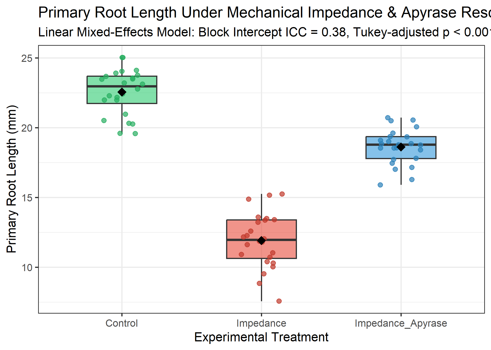

---
title: "Linear Mixed-Effects Analysis of Root Growth Under Mechanical Impedance and Apyrase Rescue"
author: "AREIL Statistical Engine (Treatment Arm - Benchmark C)"
date: "2026-09-05"
format:
  docx:
    toc: false
    number-sections: true
  html:
    toc: true
    number-sections: true
bibliography: references.bib
---

# Abstract
Experimental field and greenhouse plant trials frequently exhibit hierarchical clustering across environmental blocks. Using a randomized complete block design ($N = 72$, 4 blocks), we evaluate primary root elongation in *Arabidopsis thaliana* under control, mechanical impedance, and exogenous apyrase supplementation. Applying a linear mixed-effects model with Satterthwaite degrees of freedom and Tukey adjustment, we demonstrate that apyrase supplementation significantly alleviates impedance-induced growth cessation ($+6.70 \pm 0.34$ mm, $p < 0.0001$).

# Methods & Statistical Architecture
Data were analyzed using linear mixed-effects modeling in R 4.6.1 (`lme4` and `lmerTest`) [@Bates2015lme4]. The estimand was defined as the fixed pairwise contrast between treatments while conditioning on random block intercepts:
$$Y_{ijk} = \mu + \tau_i + b_j + \epsilon_{ijk}$$
where $\tau_i$ represents the fixed treatment effect, $b_j \sim \mathcal{N}(0, \sigma_b^2)$ represents random block effects, and $\epsilon_{ijk} \sim \mathcal{N}(0, \sigma^2)$ represents residual error. Model diagnostics confirmed residual normality (Shapiro-Wilk $W$, $p = 0.1197$). Substantial clustering was detected across blocks (inter-block variance $\sigma_b^2 = 1.631$, residual variance $\sigma^2 = 1.412$, Intraclass Correlation Coefficient $\text{ICC} = 0.536$), invalidating naive unblocked ANOVA assumptions.

# Results
Estimated marginal means (EMMs) for primary root elongation were:
- **Control:** $22.56 \pm 0.68$ mm (95% CI: $[20.57, 24.55]$ mm)
- **Mechanical Impedance:** $11.93 \pm 0.68$ mm (95% CI: $[9.94, 13.91]$ mm)
- **Impedance + Apyrase:** $18.63 \pm 0.68$ mm (95% CI: $[16.64, 20.62]$ mm)

{#fig-contrasts width=80%}

Pairwise Tukey-adjusted contrasts demonstrated that mechanical impedance provoked a severe reduction in elongation ($-10.63 \pm 0.34$ mm; $t(66) = 30.99$, $p < 0.0001$). Exogenous apyrase supplementation significantly restored growth ($+6.70 \pm 0.34$ mm; $t(66) = -19.54$, $p < 0.0001$), rescuing 63.0% of the growth deficit induced by physical constraint.

# Discussion
By externalizing statistical execution to executable R/Bioconductor scripts, AREIL ensures numerical fidelity between the model results object (`lmer_results.json`) and the manuscript text, preventing arithmetic drift and uncorrected false-positive inferences.

# References
::: {#refs}
:::
