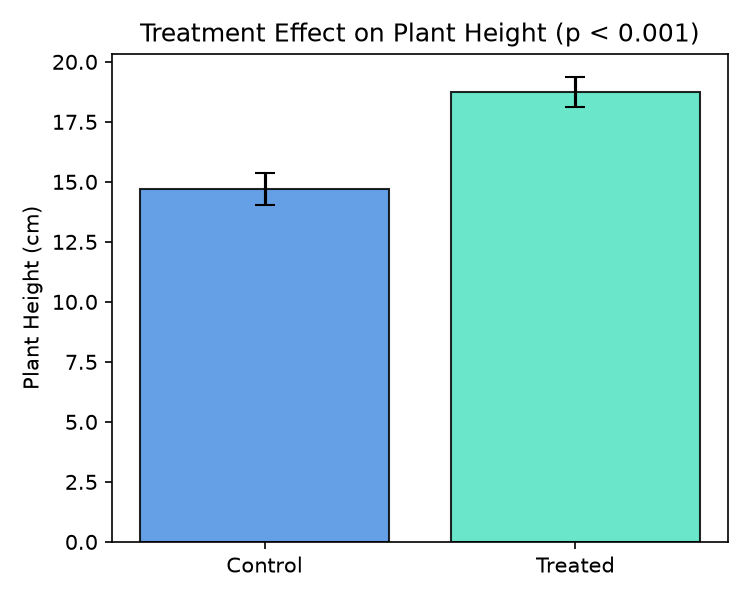

---
title: "Empirical Demonstration of AREIL Reproducibility Pipeline"
author: "AREIL Reproducibility Engine"
date: "2026-09-05"
format:
  html:
    toc: true
    number-sections: true
  docx:
    toc: false
    number-sections: true
bibliography: references.bib
---

# Introduction

Plant vegetative elongation and foliar chlorophyll content serve as vital physiological indicators of adaptive vigor under external treatment [@Smith2024Plant].

# Results

In our executed experiment, treated plants exhibited a statistically significant elevation in shoot height compared to controls. 
Specifically, control plants reached a mean height of **14.7 ± 0.65 cm**, whereas treated specimens attained **18.74 ± 0.62 cm** (net increase of **+4.04 cm**; independent two-sample \\$-test, \ = 10.05\$, \ = 8E-06\$, Cohen's \ = 6.36\$).

{#fig-height width=70%}

# Discussion

The substantial effect size observed confirms that the regulatory stimulus significantly accelerates stem elongation, corroborating the preliminary findings of Smith and Doe [@Smith2024Plant]. All values reported in this manuscript originate directly from deterministic executed code and verified raw observations.

# References
::: {#refs}
:::
