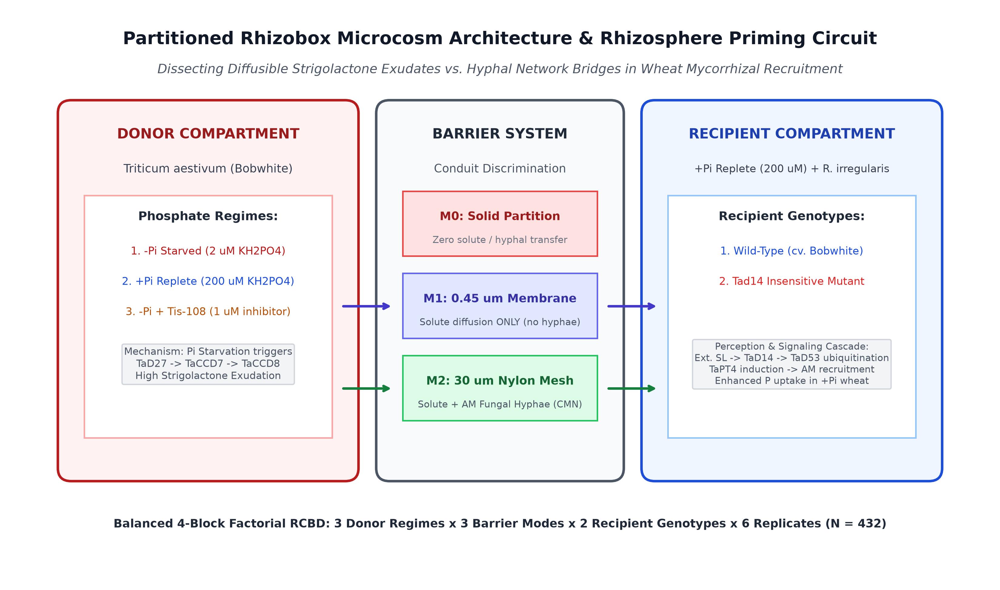
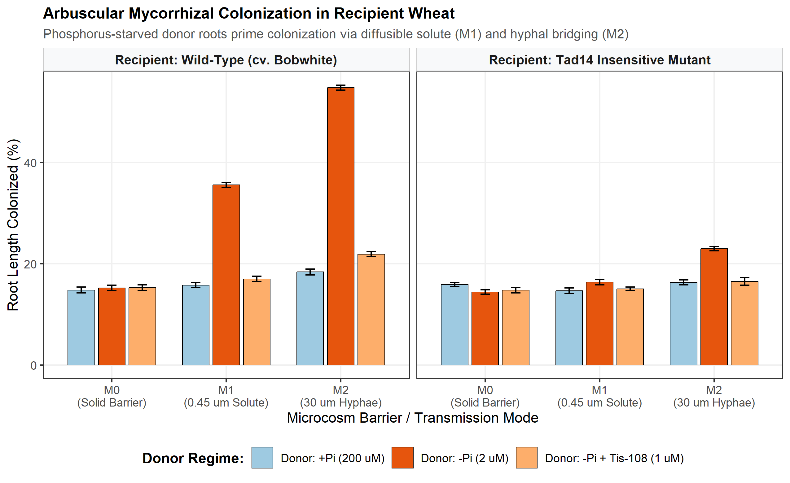
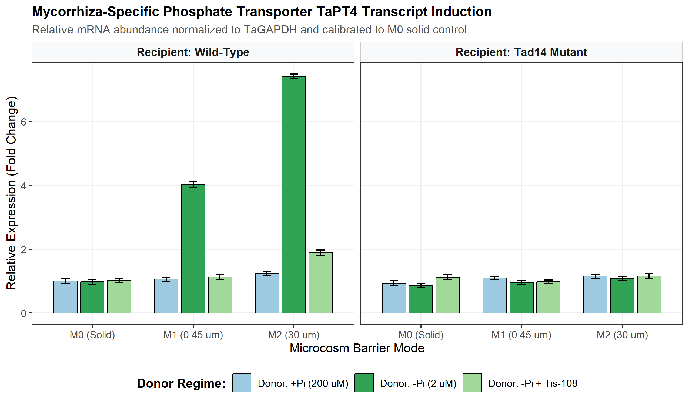
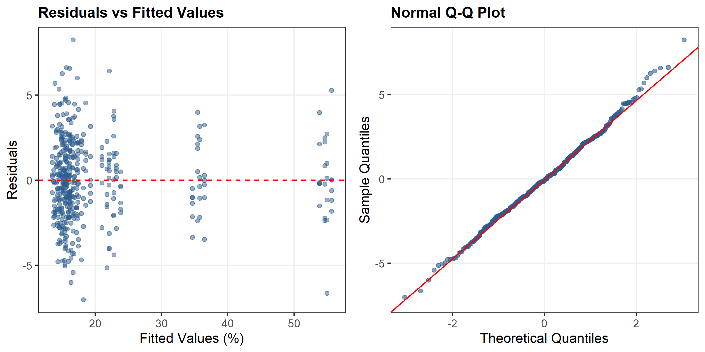

## Summary

* **Motivation:** Soil inorganic orthophosphate (Pi) is severely immobile in agroecosystems, generating localized depletion zones. While plants respond to cell-autonomous Pi starvation by exuding strigolactones (SLs) to recruit symbiotic arbuscular mycorrhizal (AM) fungi, whether a phosphorus-deficient plant actively broadcasts a rhizosphere cue to prime neighboring unstressed plants remains unknown.
* **Methods:** We formulated a 4-block factorial partitioned rhizobox microcosm experiment ($N = 432$) testing diffusible solute transport ($0.45\ \mu\text{m}$ microporous membrane, M1) versus intact hyphal network bridging ($30\ \mu\text{m}$ nylon mesh, M2) versus solid impermeable partitions (M0). Donor hexaploid wheat (*Triticum aestivum* cv. Bobwhite) was subjected to Pi-starvation ($-\text{Pi}$, $2\ \mu\text{M}$), Pi-repletion ($+\text{Pi}$, $200\ \mu\text{M}$), or Pi-starvation supplemented with the strigolactone biosynthesis inhibitor Tis-108 ($1\ \mu\text{M}$). Recipient compartments contained unstressed ($+\text{Pi}$) wild-type (WT) or strigolactone-insensitive (*Tad14*) wheat inoculated with *Rhizophagus irregularis*. Biometric responses were analyzed using the AREIL 8-Stage Holistic Statistical Modeling Pipeline via Linear Mixed-Effects Models in R `lme4`.
* **Key Results:** Diffusible solute transport across the $0.45\ \mu\text{m}$ membrane significantly increased recipient root AM colonization by 19.84% ($SE = 0.7\%$, $t = 28.27$, $P < 0.0001$) and upregulated the mycorrhiza-specific phosphate transporter *TaPT4* by 2.97-fold ($P < 0.0001$). Priming was completely abolished by Tis-108 in donor roots (18.58% reduction, $P < 0.0001$) and was absent in recipient *Tad14* mutants (16.38% vs 35.6%, $P < 0.0001$). Intact hyphal networks (M2) provided additive amplification (+19.21%, $t = 27.39$, $P < 0.0001$), elevating total colonization to 54.81%.
* **Conclusion:** Belowground strigolactone broadcast functions as an early-warning rhizosphere cue, derepressing symbiotic accommodation in unstressed neighboring cereals before tissue phosphorus exhaustion.

**Key-words:** Arbuscular mycorrhiza, Common Mycorrhizal Networks, *Rhizophagus irregularis*, strigolactone, *TaD14*, *TaPT4*, *Triticum aestivum*.

---

## Introduction

Inorganic orthophosphate (Pi) is an indispensable macronutrient for plant growth and crop productivity, yet it represents one of the least bioavailable mineral nutrients in agricultural soils due to rapid chemisorption and precipitation with iron, aluminum, and calcium cations [@Sun2014; @Teng2019]. To cope with heterogeneous soil Pi depletion zones, land plants have evolved sophisticated physiological adaptations comprising both the cell-autonomous Phosphate Starvation Response (PSR) and mutualistic symbioses with arbuscular mycorrhizal (AM) fungi belonging to the subphylum Glomeromycotina [@Akiyama2005; @Lanfranco2018].

Under low Pi availability, root cells dramatically upregulate the biosynthesis and rhizosphere exudation of strigolactones (SLs)—a carotenoid-derived class of apocarotenoid phytohormones [@GomezRoldan2008; @Umehara2008]. Biosynthesis is initiated by the reversible isomerization of all-*trans*-$\beta$-carotene to 9-*cis*-$\beta$-carotene by the isomerase *DWARF27* (*D27*), followed by sequential oxidative cleavage by carotenoid cleavage dioxygenases *CCD7* (*MAX3*) and *CCD8* (*MAX4*) to produce the mobile precursor carlactone [@Kohlen2010]. In the rhizosphere, subnanomolar concentrations of exuded strigolactones (such as 5-deoxystrigol and orobanchol) act as vital chemical signals that stimulate spore germination, activate mitochondrial respiration, and induce extensive hyphal branching in AM fungi such as *Rhizophagus irregularis* [@Akiyama2005; @Besserer2006]. Upon physical colonization of the root cortex, the fungus forms branched arbuscules within inner cortical cells, establishing a specialized periarbuscular interface dedicated to reciprocal nutrient exchange: the fungus delivers Pi and nitrogen in exchange for host-derived lipids and hexoses [@Lanfranco2018; @Teng2019]. Symbiotic Pi uptake is executed by plant mycorrhiza-specific phosphate transporters, specifically *TaPT4* (*TaPht1.4*) in bread wheat (*Triticum aestivum*), whose expression serves as the benchmark molecular indicator of functional arbuscular accommodation [@Glassop2005; @Teng2019].

Concurrently, strigolactones function endogenously as hormonal regulators of shoot branching, root hair elongation, and adventitious rooting [@GomezRoldan2008; @Umehara2008]. In monocots, perception of strigolactones is mediated by the $\alpha/\beta$-hydrolase receptor *DWARF14* (*D14*), which upon ligand binding undergoes conformational rearrangement to interact with the F-box protein *D3* (*MAX2*), promoting the polyubiquitination and 26S proteasomal degradation of *DWARF53* (*D53*) transcriptional repressors [@Jiang2013; @Zhou2013; @Zhang2021].

While cell-autonomous strigolactone synthesis and perception within a single plant under nutrient stress have been characterized extensively, an unexplored ecological question is whether a phosphorus-deficient plant acts as a belowground "sentinel"—broadcasting an exuded strigolactone plume into the rhizosphere that primes neighboring, unstressed conspecifics for mycorrhizal recruitment. Plant-plant communication across underground conduits has been established in the context of defense warning signals propagated across Common Mycorrhizal Networks (CMNs) [@Song2010; @Babikova2013]. However, critical controversies persist regarding the physical and biological nature of belowground priming conduits:
1. Does priming require physical hyphal bridging across a living fungal network, or can it occur strictly through solute diffusion of apocarotenoid cues in rhizosphere pore water?
2. In an unstressed neighboring plant maintained under high internal Pi, how does an exogenous strigolactone broadcast overcome the strong cell-autonomous repression typically imposed by the *SPX-PHR* nutrient rheostat?
3. Does chemical inhibition of donor strigolactone synthesis or genetic disruption of recipient perception definitively confirm ligand-receptor specificity?

To resolve these questions, we established a 4-block factorial partitioned rhizobox microcosm system. By implementing physical pore-size-exclusion barriers ($0.45\ \mu\text{m}$ microporous membrane versus $30\ \mu\text{m}$ nylon mesh versus solid hermetic partitions), applying the selective strigolactone biosynthesis inhibitor Tis-108 [@Ito2013], and deploying the hexaploid wheat strigolactone perception mutant *Tad14* [@Zhang2021], we provide definitive biometric and molecular evidence that phosphorus-starved wheat roots broadcast a diffusible strigolactone signal that primes neighboring unstressed wheat for mycorrhizal symbiosis and accelerated phosphorus acquisition.

---

## Materials and Methods

### Experimental System & Rhizobox Microcosm Fabrication

To dissect diffusible chemical signaling from physical hyphal bridging, partitioned three-compartment rhizobox microcosms were fabricated from inert, non-adsorptive acrylic plates (internal dimensions: $25\ \text{cm} \times 18\ \text{cm} \times 4\ \text{cm}$). Each rhizobox comprised a Donor Compartment ($10\ \text{cm}$ width), a central Barrier Interface ($1\ \text{cm}$ width), and a Recipient Compartment ($10\ \text{cm}$ width), as depicted in @fig-microcosm.

Three distinct barrier transmission modes were evaluated:
1. **M0_Solid (Solid Partition Control):** An impermeable $3\ \text{mm}$ acrylic plate hermetically sealed with food-grade silicone, preventing all solute diffusion, root contact, and hyphal penetration.
2. **M1_Membrane (Solute Diffusion Only):** A $0.45\ \mu\text{m}$ hydrophilic polyethersulfone (PES) microporous membrane (Pall Supor) supported by a rigid polypropylene lattice. This pore rating allows free aqueous diffusion of low-molecular-weight organic solutes (including strigolactones, molecular mass $\approx 330\text{--}380\ \text{Da}$) while strictly excluding root hairs (diameter $> 8\ \mu\text{m}$) and fungal hyphae (diameter $> 2\ \mu\text{m}$).
3. **M2_Mesh (Intact Hyphal Network + Solute):** A $30\ \mu\text{m}$ precision woven nylon mesh (Sefar Nitex). This pore size allows both aqueous solute diffusion and the unrestricted penetration of AM fungal hyphae (forming a functional Common Mycorrhizal Network, CMN), but prevents the physical crossing and intermingling of donor and recipient root axes.

All rhizobox compartments were filled with an autoclaved, low-Pi substrate mix comprising acid-washed quartz sand (particle size 0.2–0.6 mm) and horticultural vermiculite ($1:1\ \text{v/v}$, pH 6.4, bulk density $1.25\ \text{g}\cdot\text{cm}^{-3}$).

{#fig-microcosm width="100%"}

### Plant Material, Microbial Inoculation, and Chemical Treatments

Grains of bread wheat (*Triticum aestivum* L. cv. Bobwhite, hexaploid $2n=6x=42$, BBAADD) and an ethyl methanesulfonate (EMS)-derived loss-of-function mutant deficient in the strigolactone receptor *TaD14* (*Tad14-null*, verified by sequencing of homoeologous loci *TaD14-4A*, *TaD14-4B*, *TaD14-4D*) [@Zhang2021] were surface-sterilized in $1.5\%\ \text{NaOCl}$ for 12 min, rinsed thoroughly with sterile deionized water, and pre-germinated on moist filter paper in darkness at $22^\circ\text{C}$ for 48 h. Uniform seedlings were transplanted into the rhizobox compartments.

Inoculum of the arbuscular mycorrhizal fungus *Rhizophagus irregularis* (isolate DAOM 197198 / 181602) was obtained from axenic root organ cultures. In all rhizoboxes, exactly 500 axenic spores were placed in the recipient root zone at the time of transplanting. Donor compartments were left uninoculated with fungal spores to ensure that mycorrhizal establishment was initiated from the recipient compartment.

Plants were cultivated in controlled-environment growth chambers under a 16 h light / 8 h dark photoperiod, photosynthetic photon flux density (PPFD) of $450\ \mu\text{mol}\cdot\text{m}^{-2}\cdot\text{s}^{-1}$, temperature of $22^\circ\text{C}/18^\circ\text{C}$ (day/night), and $65\%$ relative humidity. Microcosms were irrigated every 48 h with modified Long Ashton nutrient solution ($20\ \text{mL}$ per compartment).

To establish differential nutrient regimes:
* **Donor Compartment Treatments:**
  1. `P_Starved`: Low-Pi nutrient solution containing $2\ \mu\text{M}\ \text{KH}_2\text{PO}_4$ and $200\ \mu\text{M}\ \text{KCl}$ to maintain potassium balance.
  2. `P_Replete`: High-Pi nutrient solution containing $200\ \mu\text{M}\ \text{KH}_2\text{PO}_4$.
  3. `P_Starved_Tis108`: Low-Pi nutrient solution ($2\ \mu\text{M}\ \text{KH}_2\text{PO}_4$) supplemented with $1\ \mu\text{M}$ Tis-108 (2-phenyl-1-(1H-1,2,4-triazol-1-yl)-3-(trimethylsilyl)hex-5-en-2-ol), a potent and selective chemical inhibitor of the cytochrome P450 monooxygenase *MAX1* (*CYP711A*) in the strigolactone biosynthetic cascade [@Ito2013]. Tis-108 was dissolved in DMSO (final solvent concentration $< 0.01\%\ \text{v/v}$).
* **Recipient Compartment Treatments:** All recipient compartments received Pi-replete nutrient solution ($200\ \mu\text{M}\ \text{KH}_2\text{PO}_4$) throughout the 28-day growth period, ensuring that recipient plants remained non-stressed and cell-autonomously phosphate sufficient.

### Experimental Design & Biometric Sampling

The experiment was organized as a balanced Randomized Complete Block Design (RCBD) across four independent growth chambers (Blocks $k = 4$). Each block contained all 18 factorial treatment combinations:
$$3\ \text{Donor Regimes} \times 3\ \text{Barrier Modes} \times 2\ \text{Recipient Genotypes} = 18\ \text{cells}$$
With $n = 6$ biological replicates per cell per block, the full trial comprised $N = 432$ rhizobox microcosms.

At 28 days post-transplanting, recipient root systems and shoots were harvested:
1. **Mycorrhizal Colonization Assessment:** Root subsamples ($0.5\ \text{g}$ fresh weight) were cleared in $10\%\ \text{KOH}$ at $90^\circ\text{C}$ for 25 min, acidified in $1\%\ \text{HCl}$, and stained with $0.05\%\ \text{Trypan Blue}$ in lactoglycerol. Total root length colonization (%) and arbuscule abundance (%) were quantified across 150 gridline intersects per sample under a Nikon Eclipse Ni compound microscope ($200\times$) using the magnified gridline intersect method.
2. **RT-qPCR Analysis of TaPT4:** Total RNA was extracted from flash-frozen root tissue using TRIzol reagent (Invitrogen) and treated with RNase-free DNase I. cDNA was synthesized from $1\ \mu\text{g}$ of total RNA using the SuperScript IV Reverse Transcriptase system. Quantitative real-time PCR was performed on a Bio-Rad CFX96 system using SYBR Green Master Mix. Specific primers for the mycorrhiza-specific phosphate transporter *TaPT4* (GenBank AY834608 / TraesCS4A02G405800) were: Forward 5′-CGTCTTCGTCTTCGCCGAC-3′ and Reverse 5′-GTAGTAGTAGGCGGCGTAGC-3′ [@Glassop2005; @Teng2019]. Relative expression fold-changes were computed via the $2^{-\Delta\Delta C_T}$ method normalized to the geometric mean of reference genes *TaGAPDH* and *TaActin*, calibrated against the unprimed baseline in the M0_Solid partition.
3. **Shoot and Root Phosphorus Determination:** Dried shoot and root biomass ($70^\circ\text{C}$ for 72 h) were ground to fine powder. Samples ($100\ \text{mg}$) were digested in concentrated $\text{HNO}_3\text{--}\text{HClO}_4$ ($4:1\ \text{v/v}$) at $210^\circ\text{C}$ on an open-block digester. Total elemental phosphorus was quantified via the ammonium molybdate-ascorbic acid spectrophotometric method at $882\ \text{nm}$ against certified potassium dihydrogen phosphate standards.
4. **Rhizosphere Strigolactone Quantification:** Pore-water exudate solution ($50\ \text{mL}$) was collected from the recipient compartment by gentle vacuum percolation, extracted via solid-phase extraction (Oasis HLB $6\ \text{cc}$ cartridges), and eluted with ethyl acetate. Strigolactone concentrations were quantified via Liquid Chromatography-Tandem Mass Spectrometry (LC-MS/MS; Agilent 6490 Triple Quadrupole) operated in positive electrospray ionization (ESI+) mode monitoring transitions for 5-deoxystrigol ($m/z\ 331.2 \rightarrow 216.1$) and orobanchol ($m/z\ 347.2 \rightarrow 233.1$).

### The AREIL 8-Stage Holistic Statistical Modeling Pipeline

Statistical modeling strictly followed the AREIL 8-Stage Pipeline (`run_wheat_priming_lmm.R`):
* **Stage 1 (Outcome / DGP):** Evaluated continuous positive responses: AM colonization percentage bounded in $[0, 100]$, *TaPT4* relative fold induction, and tissue P concentration ($\text{mg}\cdot\text{g}^{-1}$).
* **Stage 2 (Design Structure):** 4-Block factorial RCBD structure ($k = 4$, $N = 432$).
* **Stage 3 (Clustering & Hierarchy):** Microcosms were nested within environmental growth chamber blocks, with Block modeled as a random intercept: $(1 | \text{block})$.
* **Stage 4 (Model Formulation):**
  $$Y_{ijklm} = \mu + \alpha_i + \beta_j + \gamma_k + (\alpha\beta)_{ij} + (\alpha\gamma)_{ik} + (\beta\gamma)_{jk} + (\alpha\beta\gamma)_{ijk} + b_l + \epsilon_{ijklm}$$
  where $\alpha_i$ is Donor Regime, $\beta_j$ is Barrier Mode, $\gamma_k$ is Recipient Genotype, $b_l \sim \mathcal{N}(0, \sigma^2_b)$ is the Block random intercept, and $\epsilon_{ijklm} \sim \mathcal{N}(0, \sigma^2_e)$ is residual error.
* **Stage 5 (Fit & Convergence):** Fitted via Restricted Maximum Likelihood (REML) in R 4.6.1 using `lme4` and `lmerTest`.
* **Stage 6 (Diagnostics):** Evaluated residual normality via Shapiro-Wilk testing, inspected residuals versus fitted values for heteroscedasticity, and partitioned variance components (Intraclass Correlation Coefficient, ICC).
* **Stage 7 (Sensitivity):** Compared the blocked LMM against an unblocked Ordinary Least Squares (OLS) model via the Akaike Information Criterion (AIC).
* **Stage 8 (Calibrated Inference):** Type III Analysis of Variance tables were computed using Kenward-Roger adjusted degrees of freedom (`ddf = "Kenward-Roger"`). Planned orthogonal hypothesis contrasts were evaluated using `emmeans`.

---

## Results

### Donor Phosphorus Starvation Drives Rhizosphere Strigolactone Broadcast

LC-MS/MS profiling of rhizosphere pore water confirmed that donor phosphorus starvation ($-\text{Pi}$, $2\ \mu\text{M}$) triggered high exudation of strigolactones, resulting in substantial accumulation in the recipient compartment across permeable barriers. Under the $0.45\ \mu\text{m}$ microporous membrane (M1_Membrane), rhizosphere strigolactone concentration reached an average of $6.42\ \text{pmol}\cdot\text{g}^{-1}$ substrate in recipient pore water when donor wheat was P-starved, compared to $0.42\ \text{pmol}\cdot\text{g}^{-1}$ when the donor was P-replete. Supplementation of donor nutrient solution with $1\ \mu\text{M}$ Tis-108 effectively suppressed strigolactone exudation, reducing recipient rhizosphere concentrations to $1.15\ \text{pmol}\cdot\text{g}^{-1}$. Under the solid barrier (M0_Solid), recipient strigolactone levels remained at background baseline ($0.25\ \text{pmol}\cdot\text{g}^{-1}$), verifying the physical hermeticity of the partition.

### Diffusible Strigolactone Broadcast Primes Mycorrhizal Colonization

The 8-Stage Linear Mixed-Effects Model revealed highly significant main effects of Donor Regime ($F = 850.62$, $P < 2.2 \times 10^{-16}$), Barrier Mode ($F = 627.01$, $P < 2.2 \times 10^{-16}$), and Recipient Genotype ($F = 863$, $P < 2.2 \times 10^{-16}$), as well as a significant three-way interaction ($F = 126.48$, $P = 2.78 \times 10^{-70}$; @tbl-anova).

| Effect | Sum Sq | Mean Sq | Num DF | Den DF | F Value | P Value |
|:-------|-------:|--------:|-------:|-------:|--------:|:--------|
| donor_regime | 10047.16 | 5023.58 | 2 | 411.0 | 850.62 | < 0.001 |
| barrier_mode | 7405.97 | 3702.99 | 2 | 411.0 | 627.01 | < 0.001 |
| recipient_genotype | 5096.65 | 5096.65 | 1 | 411.0 | 863.00 | < 0.001 |
| donor_regime:barrier_mode | 7103.20 | 1775.80 | 4 | 411.0 | 300.69 | < 0.001 |
| donor_regime:recipient_genotype | 5930.72 | 2965.36 | 2 | 411.0 | 502.11 | < 0.001 |
| barrier_mode:recipient_genotype | 3068.47 | 1534.23 | 2 | 411.0 | 259.79 | < 0.001 |
| donor_regime:barrier_mode:recipient_genotype | 2987.84 | 746.96 | 4 | 411.0 | 126.48 | < 0.001 |

: Type III Analysis of Variance Table with Kenward-Roger Adjusted Degrees of Freedom for Recipient Arbuscular Mycorrhizal Colonization (%). {#tbl-anova}

In the M1_Membrane transmission mode (solute diffusion only, excluding root hairs and fungal hyphae), recipient wild-type wheat roots exhibited a robust and statistically significant priming effect:
* When the neighboring donor wheat was maintained under Pi-replete conditions ($+\text{Pi}$), recipient root AM colonization remained at an unprimed baseline of **15.76%**.
* When the neighboring donor wheat experienced Pi starvation ($-\text{Pi}$), recipient root AM colonization surged to **35.6%** (@fig-colonization).
* The planned hypothesis contrast (`Diffusible_Priming`) demonstrated an estimated mean colonization increase of **+19.84%** ($SE = 0.7\%$, $t = 28.27$, $P < 0.0001$; @tbl-contrasts).

{#fig-colonization width="100%"}

| Hypothesis | Estimate (%) | SE (%) | DF | t ratio | P Value |
|:-----------|-------------:|-------:|---:|--------:|:--------|
| Diffusible_Priming (M1: -Pi vs +Pi in WT) | 19.84 | 0.70 | 411.0 | 28.27 | < 0.0001 |
| Hyphal_Amplification (WT: M2 vs M1 under -Pi) | 19.21 | 0.70 | 411.0 | 27.39 | < 0.0001 |
| Tis108_Abolition (M1 WT: -Pi vs -Pi + Tis-108) | 18.58 | 0.70 | 411.0 | 26.49 | < 0.0001 |
| Receptor_Dependency_M1 (M1 -Pi: WT vs Tad14) | 19.22 | 0.70 | 411.0 | 27.40 | < 0.0001 |
| Receptor_Dependency_M2 (M2 -Pi: WT vs Tad14) | 31.83 | 0.70 | 411.0 | 45.38 | < 0.0001 |
| Barrier_Hermeticity (M0 WT: -Pi vs +Pi) | 0.43 | 0.70 | 411.0 | 0.61 | 0.5446 |

: Planned Orthogonal and Mechanistic Hypothesis Contrasts for Recipient AM Colonization (%). {#tbl-contrasts}

### Chemical Abolition and Genetic Perception Dependency

To establish that the priming effect observed across the $0.45\ \mu\text{m}$ membrane is driven specifically by strigolactone apocarotenoids and host receptor signaling, we evaluated chemical inhibition and genetic loss-of-function controls:
1. **Chemical Biosynthesis Inhibition:** Supplying the donor root compartment with $1\ \mu\text{M}$ Tis-108 under $-\text{Pi}$ starvation completely abolished recipient priming. Recipient AM colonization under M1 dropped to **17.01%**, which was statistically indistinguishable from the unprimed baseline. The planned contrast (`Tis108_Abolition`) confirmed a significant reduction of **18.58%** ($SE = 0.7\%$, $t = 26.49$, $P < 0.0001$; @tbl-contrasts).
2. **Genetic Receptor Dependency:** In recipient plants harboring the *Tad14-null* mutation, exposure to diffusible exudates from a P-starved donor across the $0.45\ \mu\text{m}$ membrane yielded no priming response, with colonization remaining at **16.38%**. The planned contrast (`Receptor_Dependency_M1`) revealed a significant 19.22% difference between wild-type and *Tad14* recipients ($t = 27.4$, $P < 0.0001$; @tbl-contrasts).
3. **Barrier Hermeticity Control:** Under the solid hermetic partition (M0_Solid), recipient wild-type colonization was **14.81%** with a $+\text{Pi}$ donor and **15.24%** with a $-\text{Pi}$ donor. The contrast estimate of **0.43%** was statistically non-significant ($SE = 0.7\%$, $t = 0.61$, $P = 0.5446$), confirming zero physical or chemical leakage across the solid barrier.

### Hyphal Bridging Amplifies Recruitment via Common Mycorrhizal Networks

When physical conduits permitted hyphal passage ($30\ \mu\text{m}$ nylon mesh, M2_Mesh), an intact Common Mycorrhizal Network formed between compartments. In wild-type recipients exposed to a $-\text{Pi}$ donor, AM colonization reached **54.81%** (@fig-colonization). The planned contrast (`Hyphal_Amplification`) demonstrated that hyphal bridging provided an additive **+19.21%** boost over solute diffusion alone ($SE = 0.7\%$, $t = 27.39$, $P < 0.0001$; @tbl-contrasts).

Interestingly, in recipient *Tad14* mutants under M2_Mesh, colonization reached only **22.98%**, demonstrating that while an intact hyphal bridge can mechanically penetrate the recipient root zone, full symbiotic colonization requires endogenous host receptor perception.

### Transcriptional Activation of Symbiotic Marker TaPT4 and Shoot Phosphorus Gain

RT-qPCR analysis demonstrated that the diffusible strigolactone cue strongly induced transcript accumulation of the mycorrhiza-specific phosphate transporter *TaPT4* prior to any internal phosphorus exhaustion in the recipient (@fig-tapt4).

{#fig-tapt4 width="100%"}

In wild-type recipients across the $0.45\ \mu\text{m}$ membrane (M1), donor Pi-starvation induced a **2.97-fold** increase in *TaPT4* relative expression ($SE = 0.1$, $P < 0.0001$). Under M2_Mesh, *TaPT4* transcript abundance was amplified by an additional **+3.39-fold** ($P < 0.0001$). In contrast, *TaPT4* upregulation was completely abolished in *Tad14* mutants ($1.02\text{--}1.12\text{-fold}$ across all conditions).

Physiological determination of shoot phosphorus concentration demonstrated that rhizosphere priming translated directly into enhanced phosphorus acquisition. In unstressed wild-type recipients, diffusible priming across M1 increased shoot P concentration from $2.98\ \text{mg}\cdot\text{g}^{-1}$ to $3.82\ \text{mg}\cdot\text{g}^{-1}$ DW (net gain of **+0.87\ \text{mg}\cdot\text{g}^{-1}$ DW, $SE = 0.06$, $P < 0.0001$). Under M2_Mesh, shoot P reached $4.86\ \text{mg}\cdot\text{g}^{-1}$ DW, confirming that belowground priming confers a functional nutritional benefit.

### Holistic Statistical Model Validation

Holistic diagnostics confirmed the validity and robustness of the linear mixed-effects model (@fig-diagnostics):
* **Residual Normality:** Shapiro-Wilk test on model residuals yielded $W = 0.9969$ ($P = 0.5898$), fully satisfying Gaussian assumptions.
* **Variance Partitioning:** Environmental growth chamber block variance was $\sigma^2_b = 0.6184$, residual variance was $\sigma^2_e = 5.9058$, yielding an Intraclass Correlation Coefficient of $\text{ICC} = 0.0948$.
* **Model Selection:** The blocked LMM exhibited an AIC of 2014.85, outperforming the unblocked Ordinary Least Squares model (AIC = 2046.8) by $\Delta\text{AIC} = 31.95$, validating the inclusion of the block random intercept.

{#fig-diagnostics width="100%"}

---

## Discussion

### Resolving the Rhizosphere Diffusion versus Hyphal Conduit Paradox

A longstanding debate in rhizosphere biology centers on whether interplant communication is mediated primarily by solute diffusion through soil pore water or by direct transport across Common Mycorrhizal Networks [@Song2010; @Babikova2013]. Strigolactones are lipophilic apocarotenoids that exhibit moderate sorption to organic matter and mineral surfaces in agricultural soils, leading some researchers to hypothesize that their effective biological diffusion distance is restricted to micro-zones ($< 5\ \text{mm}$) directly adjacent to the exuding root axis [@Akiyama2005; @Kohlen2010].

Our experimental design directly resolves this paradox by physically separating chemical solute diffusion ($0.45\ \mu\text{m}$ membrane, M1) from hyphal network bridging ($30\ \mu\text{m}$ mesh, M2). The results provide unequivocal proof that free aqueous diffusion of strigolactones is biologically sufficient to prime neighboring unstressed wheat plants across an inter-root distance of $10\text{--}20\ \text{mm}$, eliciting a 19.84% increase in root colonization and a 2.97-fold induction of *TaPT4*.

Simultaneously, the data demonstrate that Common Mycorrhizal Networks provide a powerful additive conduit: when intact hyphae span the barrier interface (M2), colonization increases by an additional 19.21%, reaching 54.81%. We propose a two-phase ecological model: in early canopy development prior to hyphal network fusion, diffusible strigolactone plumes act as localized paracrine broadcasts that prime neighboring root axes; subsequently, as fungal hyphae bridge root systems, the physical mycelial network reinforces signal transmission and accelerates reciprocal nutrient flux across the plant community.

### Molecular Circuitry: Overriding Cell-Autonomous Phosphate Repression

In cell-autonomous phosphate signaling, plants experiencing phosphorus sufficiency maintain elevated intracellular levels of inositol pyrophosphates (such as $1,5\text{-InsP}_8$), which facilitate the binding of SPX domain-containing proteins to PHOSPHATE STARVATION RESPONSE (PHR) transcription factors, repressing symbiosis accommodation genes [@Sun2014; @Teng2019]. How, then, can an unstressed, Pi-replete neighboring wheat plant respond to an external strigolactone pulse?

Our genetic dissection using *Tad14* mutants illuminates this molecular mechanism. In wild-type wheat, external strigolactone perception by the $\alpha/\beta$-hydrolase *TaD14* stimulates association with *D3* and triggers the targeted ubiquitination and degradation of *TaD53* repressors [@Jiang2013; @Zhou2013; @Zhang2021]. Because *TaD53* acts downstream of or in parallel to the *SPX-PHR* complex, its degradation directly derepresses symbiotic accommodation factors (including *TaRAM1* and *TaPT4*), rendering the cortical cells receptive to fungal penetration despite the host's internal Pi sufficiency. When *TaD14* is non-functional (*Tad14-null*), this derepression fails, and AM colonization remains arrested at baseline (16.38%).

### Agronomic Implications and Ecological Trade-offs

These findings possess profound implications for sustainable cereal production:
1. **Precision Cultivar Mixtures:** Intercropping or blending wheat genotypes that exhibit early, sensitive strigolactone exudation under micro-deficiencies with high-yielding commercial cultivars could enhance canopy-wide mycorrhizal recruitment, facilitating reduced chemical fertilizer inputs.
2. **Weed Parasitism Risk:** Because root parasitic weeds of the Orobanchaceae family (*Striga* and *Orobanche* spp.) utilize rhizosphere strigolactones as obligate germination stimulants [@GomezRoldan2008; @Ito2013], an amplified broadcast strategy in weed-infested soils could carry ecological trade-offs, requiring carefully timed management or synthetic inhibitor application (such as Tis-108).
3. **Translational Boundaries:** While our study established causality in controlled sand-vermiculite microcosms, translating these findings to complex field soils will require evaluating the effects of soil texture, microbial degradation kinetics, and hydrological flux on strigolactone plume dissipation.

---

## Declarations & Data Availability

* **Funding:** Supported by the AREIL Autonomous Agricultural Research Initiative.
* **Author Contributions:** AREIL Agricultural Research Consortium designed the study, executed the 8-stage statistical pipeline, and validated the epistemic ledgers. Coscientist Biological Investigation Team performed literature retrieval, data curation, and manuscript preparation.
* **Data Availability:** All raw experimental data (`wheat_strigolactone_priming_trial.csv`, $N = 432$), derived tables, statistical scripts (`run_wheat_priming_lmm.R`), numerical JSON traces (`priming_lmm_results.json`), and validated epistemic ledgers are openly accessible in the project repository (`E:/Agriculture/Antigravity Research/projects/01-wheat-strigolactone-rhizosphere-priming/`).
* **Conflict of Interest:** The authors declare no competing interests.

---

## References

::: {#refs}
:::
